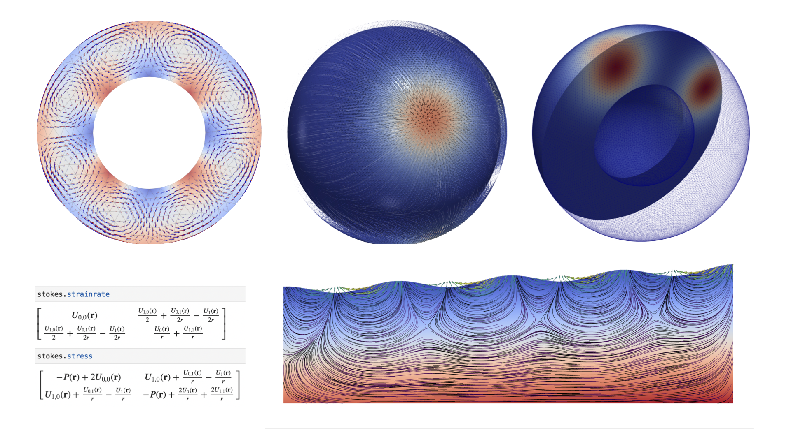

# The Underworld Geodynamics Platform

```{warning}
Warning - Underworld 3 is still in $\beta$ release
```



## A parallel, python, particle-in-cell, finite-element code for Geodynamics

Underworld is a python-friendly geodynamics code which provides a programmable and flexible front end to all the functionality of the code running in a parallel HPC environment. This gives significant advantages to the user, with access to the power of python libraries for setup of complex problems, analysis at runtime, problem steering, and coupling of multiple problems. Underworld is integrated with the literate programming environment of the jupyter notebook system for tutorials and as a teaching tool for solid Earth geoscience.

Underworld is an open-source, particle-in-cell finite element code tuned for large-scale geodynamics simulations. The numerical algorithms allow the tracking of history information through the high-strain deformation associated with fluid flow (for example, transport of the stress tensor in a viscoelastic, convecting medium, or the advection of fine-scale damage parameters by the large-scale flow). The finite element mesh can be static or dynamic, but it is not constrained to move in lock-step with the evolving geometry of the fluid. This hybrid approach is very well suited to complex fluids which is how the solid Earth behaves on a geological timescale.

#### Links

  - [Underworld Blog](https://www.underworldcode.org/articles)
  - [Underworld on Github](https://github.com/underworldcode/underworld3)
  - [Underworld documentation](https://underworldcode.github.io/underworld3/main)
  - [Underworld api documentation](https://underworldcode.github.io/underworld3/main_api)
  - [Underworld beta documentation](https://underworldcode.github.io/underworld3)


### Governance

Underworld is funded by AuScope which is part of the Australian Government's NCRIS initiative to provide community research infrastructure (please see www.auscope.org.au for more information).

The Underworld development team is based in Australia at the Australian National University, the University of Sydney and at Monash University and is led by Louis Moresi (ANU).

All development is overseen by a steering committee drawn from the supporting organisations and representatives from the Underworld community.

### Background

The numerical methods have been published in detail in Moresi et al, (2002, 2003). These papers dealt primarily with 2D applications but in recent years, we have introduced a number of improvements in the method to enable us to scale the problem to 3D (Moresi et al, 2007). For example we use a fast discrete Voronoi method to compute the integration weights of the particle-to-mesh mapping efficiently (Velic et al, 2009). We have also concentrated on extremely robust solvers / preconditioners which are necessary because the material variations and geometrical complexity are both large and unpredictable when we start of the simulation.

The benefit of this approach is associated with the separation of the computational mesh from the swarm of points which track the history. This allows us to retain a much more structured computational mesh than the deformation / material history would otherwise allow. We can take full advantage of the most efficient geometrical multigrid solvers and there is no need to preserve structure during any remeshing operations we undertake (for example if we do need to track a free surface or an internal interface). Although there are several complexities introduced by enforcing this separation, we find that the benefits, for our particular class of problems, are significant.

### Implementation and parallelism

The numerical solvers are based around the PETSc software suite which focuses on delivering good parallel scalability (up to thousands-of-cores). Our experience to date shows good scalability 2000+ cores


## Acknowledgements

We would like to acknowledge AuScope Simulation, Analysis and Modelling for providing long term funding which has made the project possible. Additional funding for specific improvements and additional functionality has come from the Australian Research Council (http://www.arc.gov.au). The python toolkit was funded by the NeCTAR eresearch_tools program. Underworld2 was originally developed in collaboration with the Victorian Partnership for Advanced Computing.

*The documentation and tutorial materials provided by the authors are open source under a creative commons licence. 
We acknowledge the contribution of the community in providing other materials and we endeavour to provide the correct attribution and citation. Please contact louis.moresi@anu.edu.au for updates and corrections.*

---

## Accessibility

<button type="button" onclick="legibleFontSwitcher()">Switch Font</button>&nbsp;&nbsp;<button type="button" onclick="fontScaler(1.1)">&#10133;</button><button type="button" onclick="fontScaler(0.0)">&#9679;</button><button type="button" onclick="fontScaler(0.909)">&#10134;</button>  


The html can also be typeset using the [Atkinson Hyperlegible](https://brailleinstitute.org/freefont) font everywhere, other than monospaced computer code, as an aid to legibility. This button is also located at the bottom of the left navigation bar on every page and will toggle between settings.


