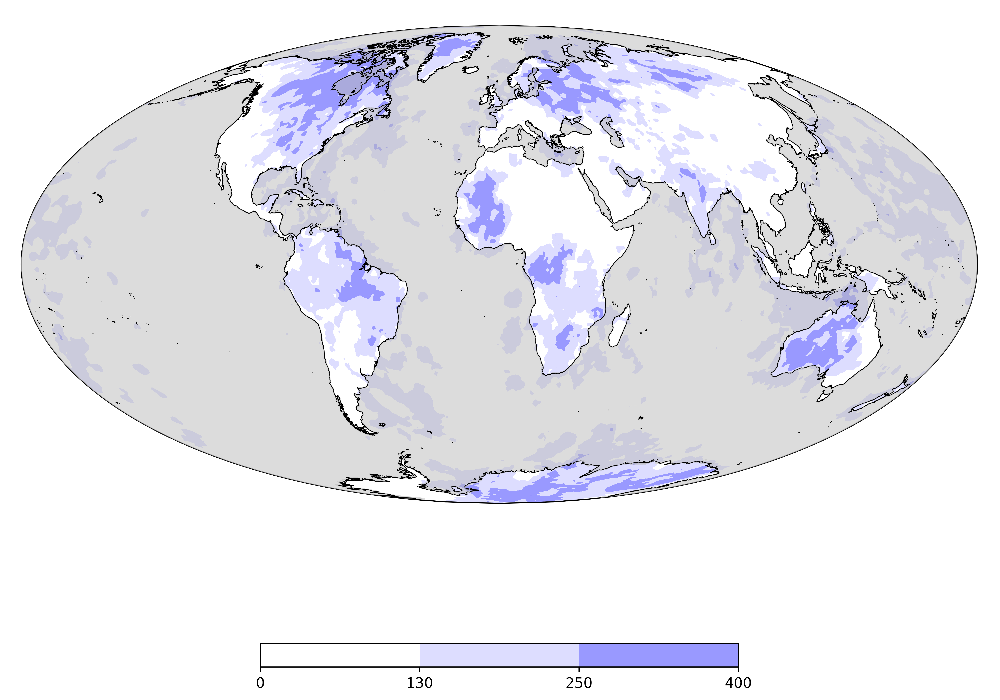

# Lecture 2 - Slides 


This is an embedded slide show that will show you a few tricks. 

<iframe src="../slideshows/example_slide_deck2.reveal.html" title="Slideshow" width=100%, height=500, allowfullscreen></iframe>


The embedding is via an `html iframe` that points to the built path (all the slides are rendered into the 
slideshows directory at the `root` level of the book)

```html
<iframe src="../slideshows/example_slide_deck2.reveal.html" title="Slideshow" width=100%, height=500, allowfullscreen></iframe>
```

## Source

This is the source code for the slide deck. It is mostly (reveal-md) markdown with 1) a `yaml` header that has reveal options in it, 2) html tags that use `reveal.js` styling. Note that it is relatively easy to make a few slides this way but more than this can become complicated.

`````markdown
separator: '<--o-->  '
verticalSeparator: '<--v-->'
revealOptions:
#    transition: 'fade'

    slideNumber: true
    width:  1100
    height: 750
    margin: 0.07
---

# Slides

- Louis Moresi
- Australian National University

<--o-->

## Slide 2

Typically, we have one or two images on a slide 



and text that explains what is going on. 
The markdown image tags are limiting but `reveal.js` has image
classes that can be used directly without too much bother:

```html

```

<--o-->

## Slide 3

Animations / styling work using `reveal.js` classes 

<p class="fragment">Fade in</p>
<p class="fragment fade-out">Fade out</p>
<p class="fragment highlight-red">Highlight red</p>
<p class="fragment fade-in-then-out">Fade in, then out</p>
<p class="fragment fade-up">Slide up while fading in</p>

<--o-->

## Slide 4 Math

Mathematics via *mathjax*

$$ e^{i\pi} + 1 = 0$$

With inline available ($e^{i\pi} = -1$) as well

<--o-->

## Slide 5 Vertical slides

Reveal has vertical sub-stacks that you can divert through

 - Vertical stack 1

<--v-->

## Slide 5.1 Vertical slides


Reveal has vertical sub-stacks that you can divert through

 - Vertical stack 2

<--v-->

## Slide 5.2 Vertical slides

Reveal has vertical sub-stacks that you can divert through

 <!-- .element height="50%" width="50%" -->

<--o-->

`````

