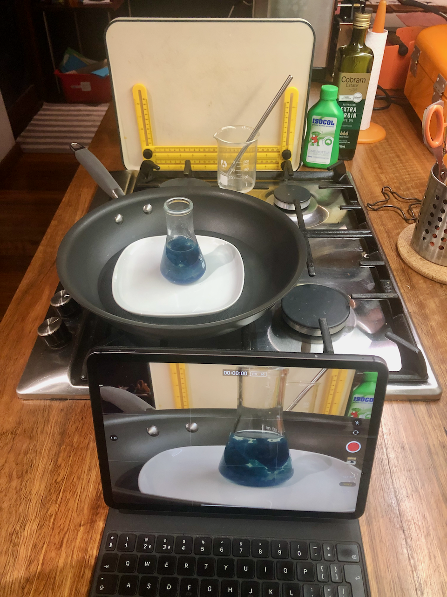
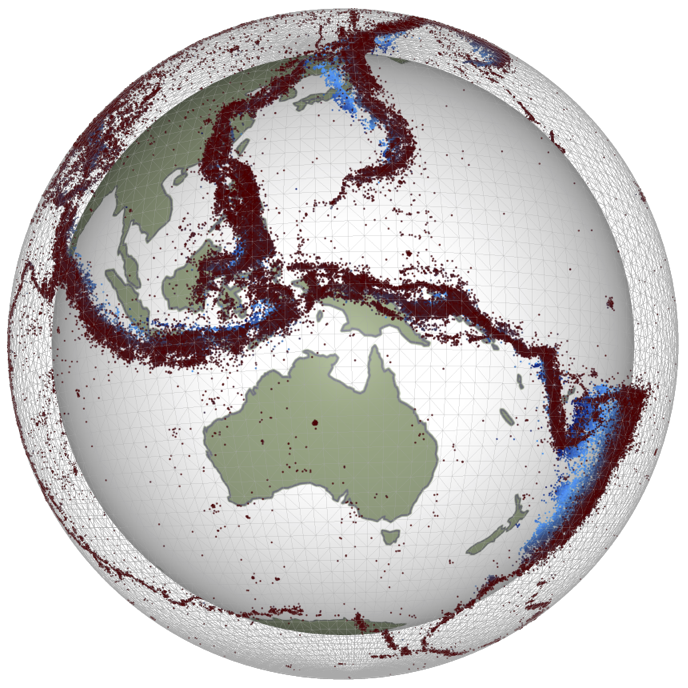

---

title: EMSC tester
separator: '<--o-->'
verticalSeparator: '<--v-->'
revealOptions:
#    transition: 'fade'
    slideNumber: true
    width:  1100
    height: 750
    margin: 0.07
---

# Example slides 1

Louis Moresi  
Australian National University

<--o-->

## Second slide

<blockquote>
    If it were done when ‘tis done, then ‘twere well <br>
    It were done quickly ... 
</blockquote>


Note: This is a speaker note that is not rendered !

<--o-->

## Slide number 3

 - one
 - two 
 - three

 [Geo-Down-Under](https://www.geo-down-under.org.au)

 ### Sub sub section

 This is an subsection of text

<--o-->

## Stokes Equation

$$ \nabla \cdot \sigma = \rho g  \mathbf{ z }   $$

<--o-->

## Image 

 <!-- .element height="50%" width="50%"  -->

```markdown
 <!-- .element height="50%" width="50%"  -->
```

<--o-->

## Image v2 

For full control on the image, including the ability to use `reveal.js` 
container sizing etc, you can use `html`



```html

```

