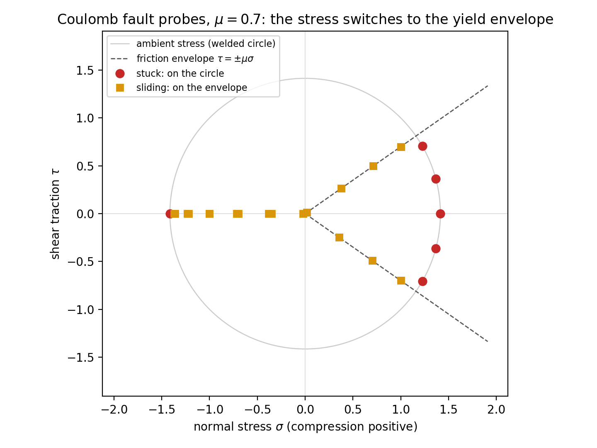
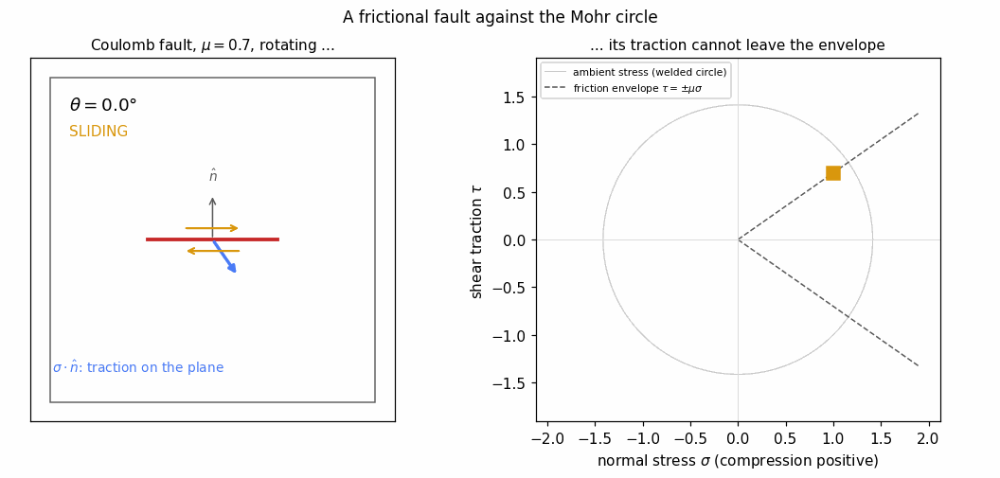
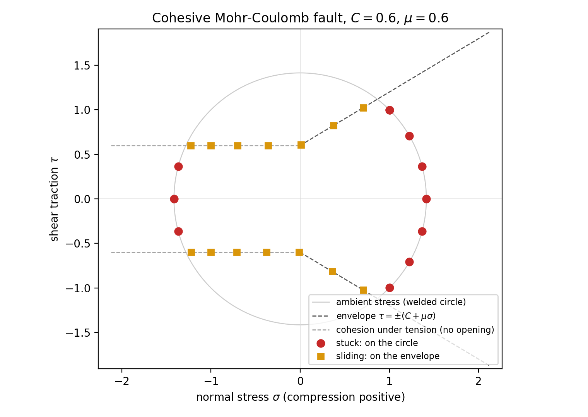
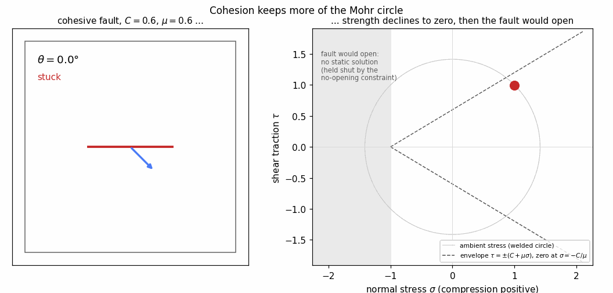
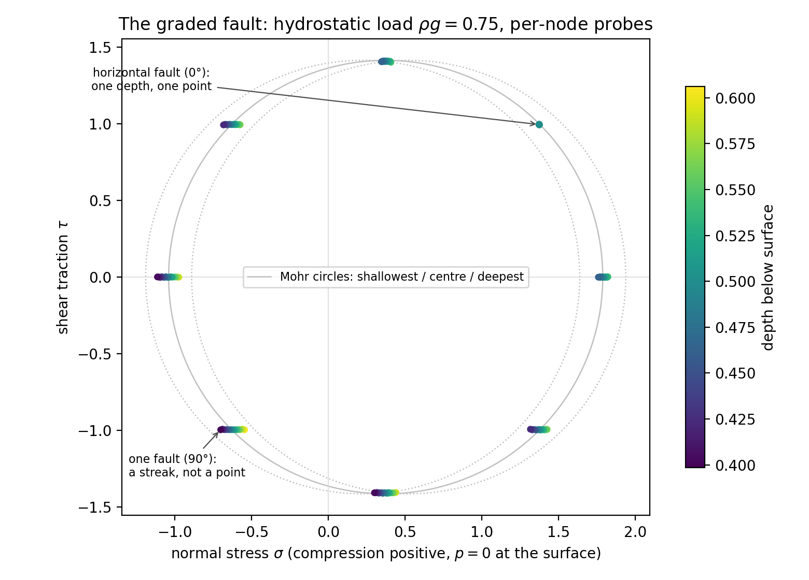
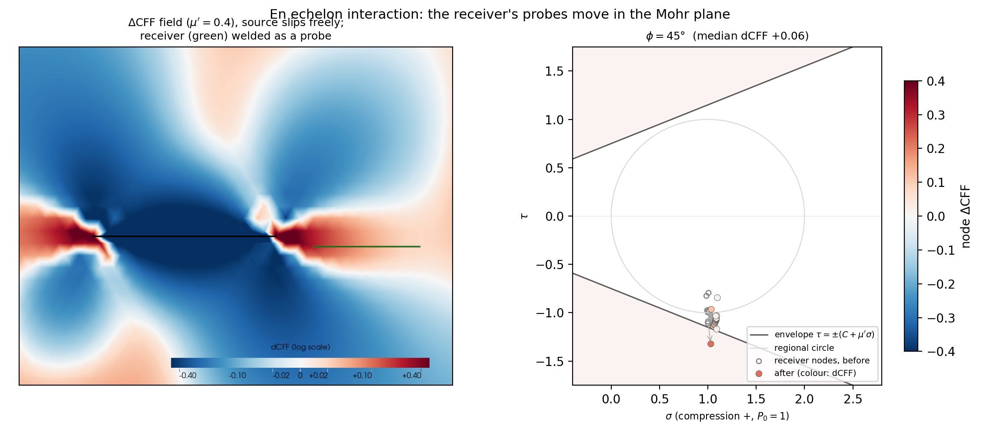
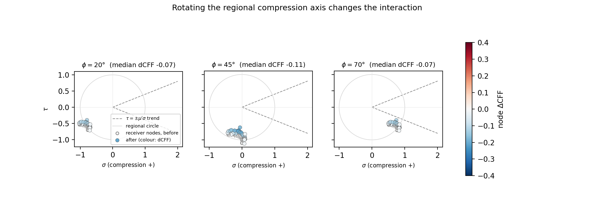
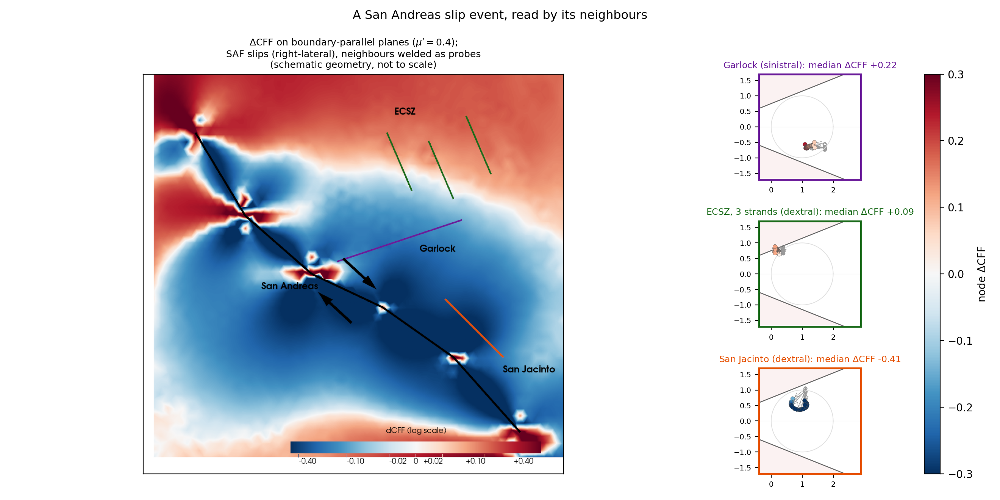

# Fault Mechanics: Teaching Examples

Three worked examples built on [split-node faults](split-node-faults.md),
each a single short script (in `figures/fault-examples/`, sharing one
harness `common.py`). All run in minutes on a laptop: the meshes are
modest, because a zero-thickness fault needs no thin feature resolved.

## The fault-strength ladder

One fault, one far-field shear drive ($\tau_\infty = 1$ resolved on the
fault plane), and the whole constitutive ladder — the slip-rate profile
$V(s)$ tells each law's story:


The right-hand column shows the shear-stress field $\sigma_{xy}$ for
each rung (colour range $0 \to 2\tau_\infty$, white at the far-field
value): a slipping fault shadows itself with a stress drop and
concentrates stress at its tips, in proportion to how much of
$\tau_\infty$ its law lets go; the stuck fault leaves the field
untouched.

- **Frictionless** — the free crack: full stress drop, elliptical
  profile (the dashed shape), slip vanishing at the unsplit tips.
- **Viscous, $\eta_f = \eta/a$** — the natural interface-viscosity
  scale: the fault slips at roughly half its free rate.
- **Coulomb, weak** ($\mu\sigma_n < \tau_\infty$) — slides at the
  reduced stress drop $\tau_\infty - \mu\sigma_n$, profile still
  elliptical: the constant-strength crack.
- **Rate-and-state** — at steady state, a velocity-dependent strength
  between the Coulomb end-members.
- **Coulomb, strong** ($\mu\sigma_n > \tau_\infty$) — stuck: creep at
  the regularisation velocity, invisible at plot scale.

Script: `figures/fault-examples/ladder.py`.

## The Mohr circle, measured by faults

All the stress-plane figures below use the **geological sign
convention**: compression positive, tension on the negative axis. (The
solver's tractions are tension-positive; only the plots flip.) There is
no confining pressure in these problems: the walls prescribe velocity
and the flow is incompressible, so pressure exists only up to the
nullspace constant and the solver's gauge centres the Mohr circle on
the origin — which is exactly why the tensile sector is reachable.

A *welded* split fault (interface dashpot with large $\eta_f$) does not
perturb the flow — the welded limit recovers the uncut continuum — but
its machinery still reports the tractions across it: the no-opening
constraint's reaction gives $\sigma_n$, and the dashpot law reads the
signed shear traction off its own slip, $\tau = \eta_f V$. Each fault
orientation is therefore a passive stress probe, and sweeping the
orientation through $180°$ traces the full Mohr circle of the ambient
stress state:


The boundary condition is Dirichlet velocity on all four walls,
imposing the homogeneous flow $\mathbf v = (a(x-\tfrac12) +
\gamma(y-\tfrac12),\; -a(y-\tfrac12))$ with $a = 0.5$, $\gamma = 1$
— a pure-shear (stretching) part plus a simple-shear part. Stress sees
only the symmetric gradient, so this is equivalent to pure shear of
magnitude $R = \eta\sqrt{4a^2+\gamma^2}$ with principal axes at
$22.5°$ to the box: deliberately not axis-aligned, so the circle's
orientation must be measured, not guessed. Because the linear flow is
an exact homogeneous Stokes solution, the stress is uniform to the
walls and every probe samples the same state; the pressure gauge (the
nullspace constant) sets the circle's centre. The probes (labelled by
fault angle)
land on that circle, centred at the (gauge-fixed) mean pressure. The
classical double-angle rule is the labels' spacing: $22.5°$ of fault
rotation moves a probe $45°$ around the circle, and $180°$ of rotation
closes it.

Script: `figures/fault-examples/mohr_circle.py`.

The measured points land on the circle too neatly to teach from a
static figure — the lesson is in the *construction*. The animated
version rotates the fault through $180°$ while its probe sweeps the
full circle at $2\theta$, one welded-fault solve per frame:


Script: `figures/fault-examples/mohr_animate.py`.

### The circle meets the friction envelope

Give the rotating fault Coulomb friction (reaction-fed normal stress)
and the probe can no longer go everywhere the ambient stress points.
Three regimes appear in one sweep:



- **Stuck** (circles): the ambient resolved stress lies inside the
  envelope $|\tau| < \mu\sigma$ — the fault transmits it and the
  probe sits on the Mohr circle;
- **Sliding** (squares): the ambient stress would exceed the envelope —
  the fault slips, drops the shear traction to its strength, and the
  probe is pinned to the yield line;
- **Held shut** ($\sigma < 0$, grey crosses): bare friction has no
  strength under tension — a real fault would OPEN, and no static
  solution exists. The bilateral no-opening constraint manufactures one
  by gluing the surfaces together (a tensile reaction), so the solver
  still converges; the probes ride the axis at $\tau = 0$, but they
  are marked unphysical. The tell, in any real model, is the sign of
  the recovered normal traction.

The shear traction here is read from the Coulomb law at the measured
slip rate — which is exact in every regime, because the regularised
law *is* the traction the fault carries. The animated build shows the
switch happening as the fault rotates, with the slip sense drawn as
half-arrows when it unlocks:



Script: `figures/fault-examples/mohr_friction.py`.

### Cohesion keeps more of the circle

Add cohesion — the envelope becomes $\tau = \pm(C + \mu\sigma)$ —
and strength survives into MILD tension, declining along the envelope
and reaching zero at $\sigma = -C/\mu$. Stuck arcs now survive
around **both** principal poles, with envelope-pinned sliding between;
beyond the cutoff the fault is in the same held-shut (unphysical)
regime as the cohesionless case, just pushed further into tension.



The cohesive law is not a canned option — it is registered as a sympy
expression in the canonical interface symbols, which is the intended
extension path for any fault rheology:

```python
V = fault_contact.slip_rate
S = fault_contact.normal_stress          # reaction-fed, clamped >= 0
law = fault_contact.SymbolicFaultLaw(
    (C + mu * S) * (2 / sympy.pi) * sympy.atan(V / V0))
```



Script: `figures/fault-examples/mohr_cohesion.py`.

### The graded fault: depth-dependent stress along one surface

Add a modest hydrostatic load (constant density, closed box — the flow
is untouched, pressure absorbs gravity exactly) and the per-node
character of the stress recovery becomes visible: every fault node sits
at its own depth, so a single welded fault contributes a **streak** of
probes, not a point. The streak is horizontal (only the pressure part
of $\sigma$ varies along the fault), longest for the vertical fault,
and collapses to a dot for the horizontal one:



Points are coloured by depth; the grey circles are the Mohr circles of
the shallowest, central, and deepest fault points. Nothing here is
averaged — $\sigma_n$ comes from the constraint reaction de-smeared
node by node, $\tau$ from the weld's own law at each node — which is
exactly the machinery that lets a friction law feel depth-dependent
strength along a single fault (the locking-depth structure of a
seismogenic zone). The closed-box pressure gauge is re-anchored in the
plot so $p = 0$ at the top surface; the shift is the analytically known
$\rho g H/2$.

Script: `figures/fault-examples/mohr_graded.py`.

## Orientation and slip: the circle's other face

The same orientation sweep with *frictionless* faults under pure shear.
Now each fault drops whatever shear stress is resolved on its plane, so
the peak slip rate follows $|\cos 2\theta|$ — the slip-rate reading of
the Mohr circle. A fault at $45°$ to the shear plane feels no resolved
shear and barely slips; the aligned fault slips fully:


Script: `figures/fault-examples/orientations.py`.

## Interacting faults: stress transfer on the Mohr plane

Two faults via `add_fault`'s network form: the *source* slips freely,
the *receiver* is welded — the passive probe from the Mohr examples.
Differencing two solves on the same mesh gives the classical Coulomb
stress transfer, and the receiver's probes show it in the diagram
students already know: each node's point MOVES, and its colour is its
own $\Delta$CFF ($\mu' = 0.4$, King's value):



The receiver sits in the source's along-strike tip lobe, and the
friction bookkeeping is dressed so the crossing is visible: a declared
confining pressure $P_0 = 1$ puts the whole circle in compression, and
a cohesive envelope $\tau = \pm(C + \mu'\sigma)$ with $C = 0.75$
passes just below the ambient cloud. Neither constant changes
$\Delta$CFF — they only place the failure line where the physics can
reach it. The loaded near-tip nodes then cross into the shaded failure
region while the far end barely moves. Rotating the regional
compression axis (the boundary velocities rotate with it) relocates
the ambient cloud around the circle, and what rotation controls is the
MARGIN to the envelope:



Two gauge points, handled explicitly in the scripts because a closed
velocity-driven box fixes pressure only up to a constant: differenced
fields are anchored to zero in the far field (a slip event changes
nothing far away), and each solve's absolute probe pressures are
anchored to the analytic ambient state. Both constants are printed,
never silently absorbed.

Script: `figures/fault-examples/interacting_faults.py`.

### A schematic southern California

The San Andreas (with its Big Bend) as the slipping trunk; the
Garlock, three East California Shear Zone strands and a San
Jacinto-like fault welded as probes — all inboard, in the continental
crust. The drive is right-lateral simple shear parallel to the plate
boundary (~N40W), which resolves dextral on the NW-striking faults and
sinistral on the Garlock, exactly the real senses; the slip arrows on
the map are drawn from the *measured* jump, not assumed:



One trunk-spanning event, three verdicts: the parallel San Jacinto is
deeply relaxed ($\Delta$CFF $-0.4$, its cloud retreating into the
safe wedge); the conjugate Garlock is *loaded* ($+0.2$, pushed toward
the envelope); the distant ECSZ strands are mildly loaded ($+0.1$) in
the far-field lobe. The kinked trunk adds its own lesson — each bend
carries a local stress pocket, with restraining-bend loading visible
on the Big Bend's flank. (Schematic geometry, not to scale; same
$P_0 = 1$, $C = 0.75$ envelope dressing.)

Script: `figures/fault-examples/california.py`.

## Where next

Remaining extensions on the same harness: tip-to-tip vs overlapped
en echelon arrangements side by side, a denser fault network, and the
graded (gravity-loaded) versions of the interaction cases.
