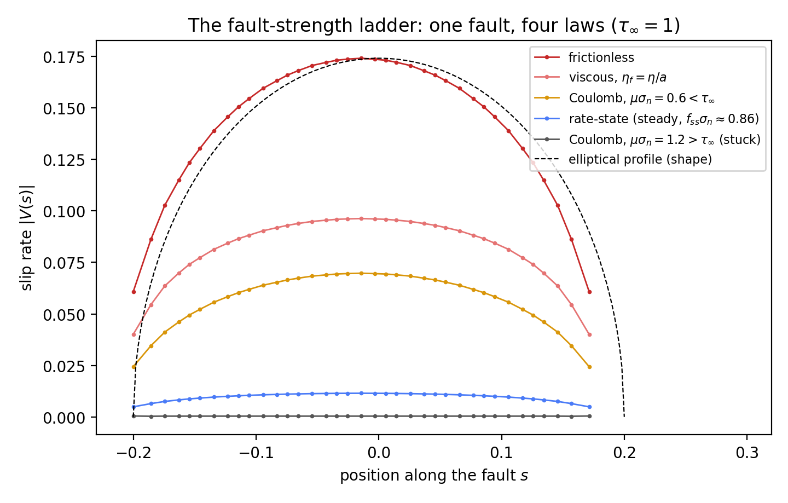
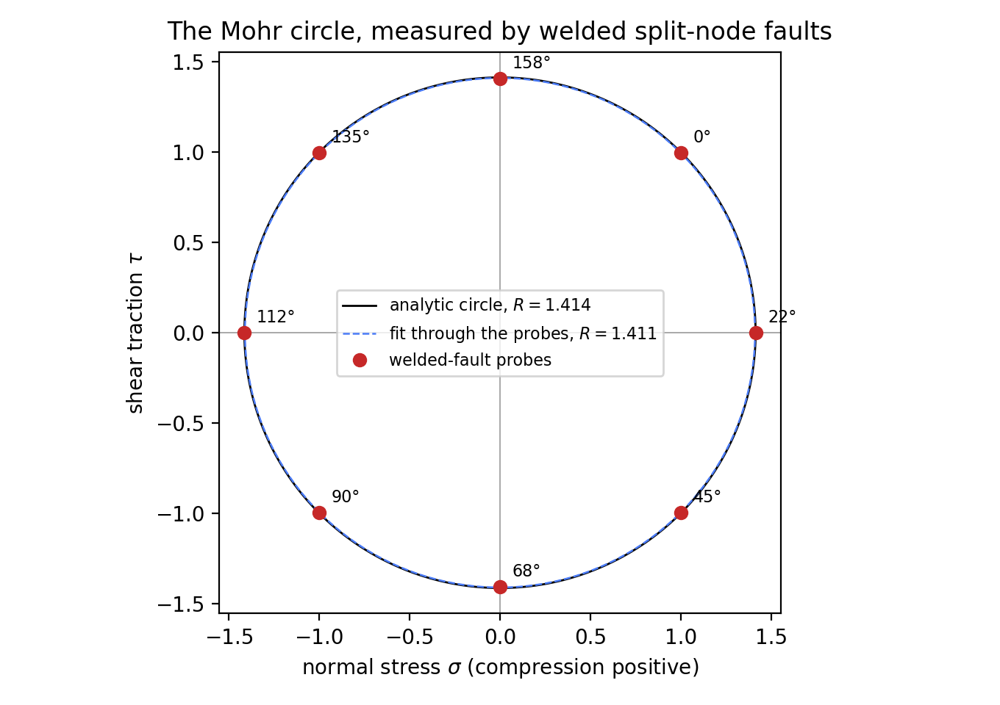
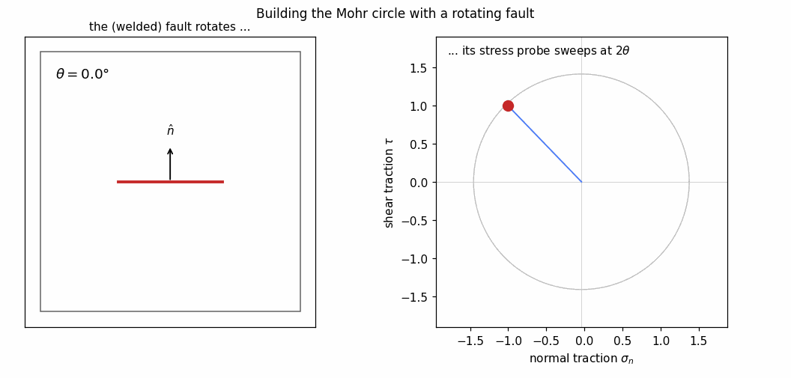

# Fault Mechanics: Teaching Examples

Three worked examples built on [split-node faults](split-node-faults.md),
each a single short script (in `figures/fault-examples/`, sharing one
harness `common.py`). All run in minutes on a laptop: the meshes are
modest, because a zero-thickness fault needs no thin feature resolved.

## The fault-strength ladder

One fault, one far-field shear drive ($\tau_\infty = 1$ resolved on the
fault plane), and the whole constitutive ladder — the slip-rate profile
$V(s)$ tells each law's story:

The right-hand column shows the shear-stress field $\sigma_{xy}$ for
each rung (colour range $0 \to 2\tau_\infty$, white at the far-field
value): a slipping fault shadows itself with a stress drop and
concentrates stress at its tips, in proportion to how much of
$\tau_\infty$ its law lets go; the stuck fault leaves the field
untouched.

- **Frictionless** — the free crack: full stress drop, elliptical
  profile (the dashed shape), slip vanishing at the unsplit tips.
- **Viscous, $\eta_f = \eta/a$** — the natural interface-viscosity
  scale: the fault slips at roughly half its free rate.
- **Coulomb, weak** ($\mu\sigma_n < \tau_\infty$) — slides at the
  reduced stress drop $\tau_\infty - \mu\sigma_n$, profile still
  elliptical: the constant-strength crack.
- **Rate-and-state** — at steady state, a velocity-dependent strength
  between the Coulomb end-members.
- **Coulomb, strong** ($\mu\sigma_n > \tau_\infty$) — stuck: creep at
  the regularisation velocity, invisible at plot scale.

Script: `figures/fault-examples/ladder.py`.

## The Mohr circle, measured by faults

A *welded* split fault (interface dashpot with large $\eta_f$) does not
perturb the flow — the welded limit recovers the uncut continuum — but
its machinery still reports the tractions across it: the no-opening
constraint's reaction gives $\sigma_n$, and the dashpot law reads the
signed shear traction off its own slip, $\tau = \eta_f V$. Each fault
orientation is therefore a passive stress probe, and sweeping the
orientation through $180°$ traces the full Mohr circle of the ambient
stress state:

The boundary condition is Dirichlet velocity on all four walls,
imposing the homogeneous flow $\mathbf v = (a(x-\tfrac12) +
\gamma(y-\tfrac12),\; -a(y-\tfrac12))$ with $a = 0.5$, $\gamma = 1$
— a pure-shear (stretching) part plus a simple-shear part. Stress sees
only the symmetric gradient, so this is equivalent to pure shear of
magnitude $R = \eta\sqrt{4a^2+\gamma^2}$ with principal axes at
$22.5°$ to the box: deliberately not axis-aligned, so the circle's
orientation must be measured, not guessed. Because the linear flow is
an exact homogeneous Stokes solution, the stress is uniform to the
walls and every probe samples the same state; the pressure gauge (the
nullspace constant) sets the circle's centre. The probes (labelled by
fault angle)
land on that circle, centred at the (gauge-fixed) mean pressure. The
classical double-angle rule is the labels' spacing: $22.5°$ of fault
rotation moves a probe $45°$ around the circle, and $180°$ of rotation
closes it.

Script: `figures/fault-examples/mohr_circle.py`.

The measured points land on the circle too neatly to teach from a
static figure — the lesson is in the *construction*. The animated
version rotates the fault through $180°$ while its probe sweeps the
full circle at $2\theta$, one welded-fault solve per frame:

Script: `figures/fault-examples/mohr_animate.py`.

## Orientation and slip: the circle's other face

The same orientation sweep with *frictionless* faults under pure shear.
Now each fault drops whatever shear stress is resolved on its plane, so
the peak slip rate follows $|\cos 2\theta|$ — the slip-rate reading of
the Mohr circle. A fault at $45°$ to the shear plane feels no resolved
shear and barely slips; the aligned fault slips fully:

Script: `figures/fault-examples/orientations.py`.

## Where next

Planned extensions of this set (same harness): a pair of interacting
faults (stress shadowing vs tip-to-tip enhancement), a small fault
network via `add_fault`'s list form, and a fault with kinked geometry.
The stress-transfer (Coulomb $\Delta$CFF lobe) example is the natural
companion piece for these.
