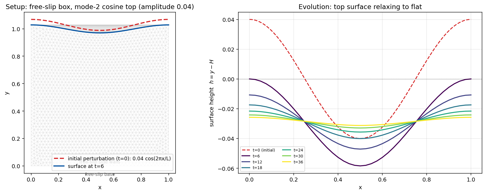
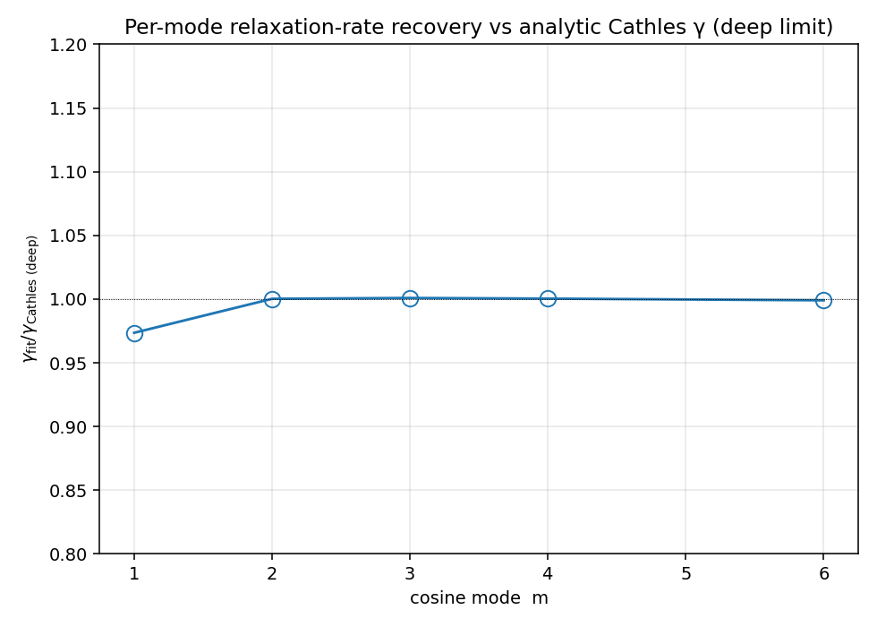
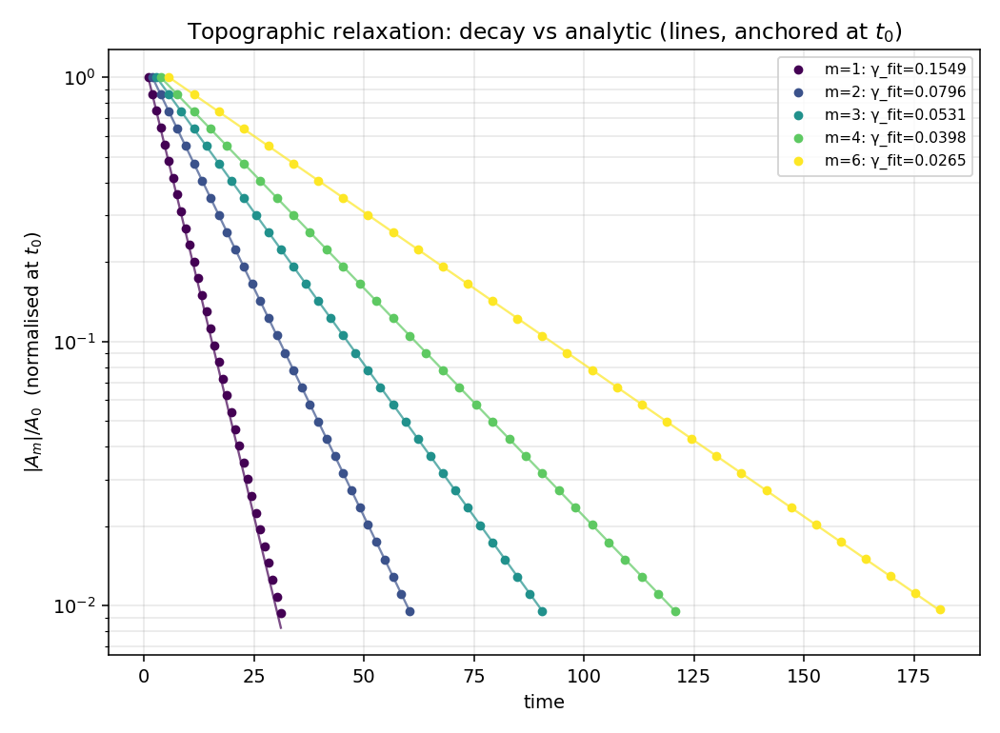
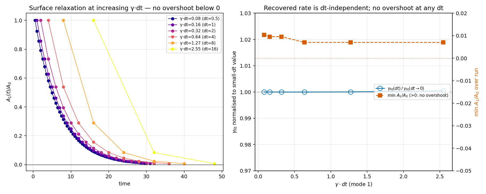
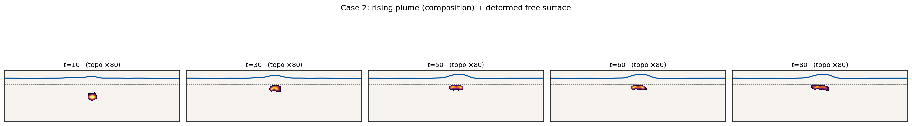
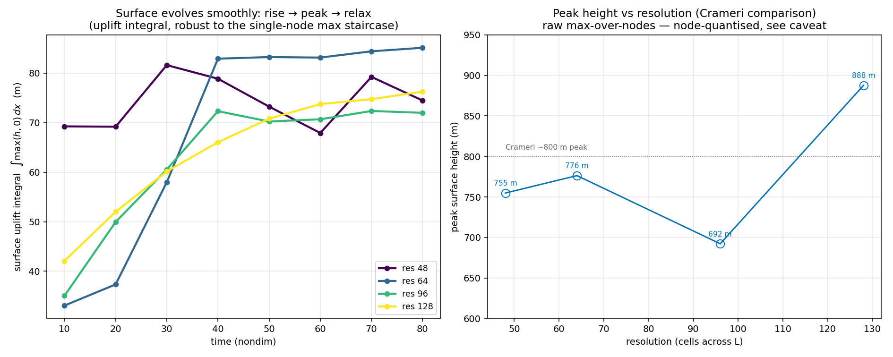
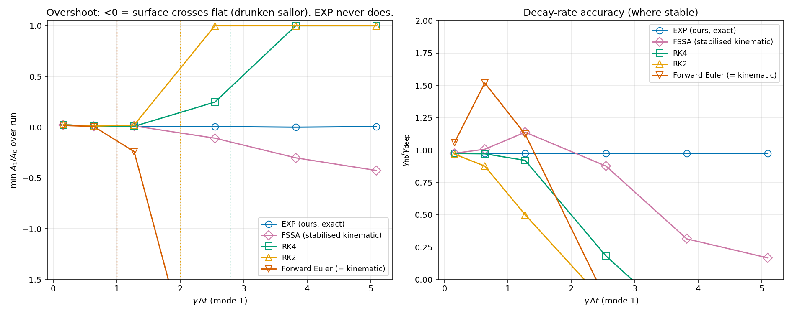
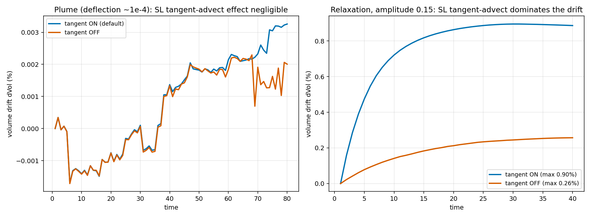

# Free-slip + prognostic dynamic topography: an exponential free-surface scheme

**Status:** design / method note. Describes the free-surface time-integration scheme
validated for old-frame semi-Lagrangian mantle convection in Underworld3, with a
[benchmark suite](#benchmarks) against Crameri et al. (2012). The two
deformed-geometry bug fixes it depends on landed in **PR #264**. The scheme is a
research method, not yet a public API.

**Reproducibility.** The benchmark driver and analysis scripts live in
`~/+Simulations/FreeSurface/crameri_study/`; they require Underworld3 with the
swarm-proxy advection fix ([#289](https://github.com/underworldcode/underworld3/issues/289)).

Related: [lagged-clone-sl-history](lagged-clone-sl-history.md),
[CONSTRAINED_FREESLIP_MULTIPLIER](CONSTRAINED_FREESLIP_MULTIPLIER.md),
[../../advanced/semi-lagrangian-time-integration](../../advanced/semi-lagrangian-time-integration.md).

---

## TL;DR

Instead of advecting a kinematic free surface with the fluid velocity (and
fighting the "drunken sailor" instability with FSSA or sticky air), we **decouple
the surface evolution from the kinematic velocity**:

1. Evolve the surface topography `h` as a **prognostic variable** that relaxes
   toward the **stress-derived equilibrium topography** `h_∞` — the instantaneous
   isostatic compensation of the normal stress on a held free-slip lid — rather
   than being advected by the kinematic normal velocity.
2. Advance `h` with an **L-stable exponential integrator** built from three numbers
   per surface node — the current height `h`, its rate `ḣ`, and `h_∞`:

   $$\gamma = \frac{\dot h}{h_\infty - h}, \qquad
     h \leftarrow h_\infty + (h - h_\infty)\,e^{-\gamma\,\Delta t}.$$

   The update lands between `h` and `h_∞` and **cannot overshoot for any `Δt`**.
3. Supply the three numbers from Stokes solves on the same mesh: a **held
   free-slip** solve gives `h_∞` (its normal stress `σ_nn`), a **stress-free** solve
   gives the rate `ḣ = u_n`, and — when material crosses matter, i.e. in convection
   — a **consistent** solve gives a velocity whose surface-normal equals the
   *realized* relaxed rate, so the surface stays a material boundary. In the linear
   / stagnant-lid limit these collapse to a single solve.

This combination is, to the best of a 2026 literature survey, **novel in
geodynamics** — see [Novelty and related work](#novelty-and-related-work). The
integrator's *mathematics* is established exponential time differencing (ETD); its
*application to a geodynamic free surface*, and the prognostic use of free-slip
stress topography in place of kinematic advection, are not in the prior art
surveyed. A [benchmark suite](#benchmarks) against Crameri et al. (2012) confirms
the per-mode relaxation rate, the no-overshoot property, and the dynamic-topography
response, and shows the exponential integrator is **uniquely both stable and
accurate** among the surface time-steppers compared.

---

## The problem this solves

A kinematically advected free surface in old-frame semi-Lagrangian convection
makes isoviscous Ra = 1e5 convection **spuriously decay toward sub-critical**
(Nu 13.6 → 5; the interior cools), across every kinematic scheme tried
(relax-to-`h_eq`, kinematic-FE, kinematic-exact).

The cause is **not** mass flux or amplitude. It is a **lag between the surface
position and the advecting velocity**. At a downwelling the old-frame
semi-Lagrangian foot `x − v·Δt` lands *beyond* the under-moved / smoothed /
relaxation-lagging surface, into the cold `T = 0` boundary condition → cold is
advected inward. Any surface lag (Fourier truncation, smoothing, relaxation
under-move) becomes a **cold pump**.

The trap is the surface normal velocity itself. The free-surface `u_n` is huge
(~65 in non-dimensional units) and barely decays even when the surface is
essentially at equilibrium (`h ≈ h_∞`). That residual is **convective
throughflow** (downwellings impinging on the boundary), **not** a rate of
topographic change. So raw `v·n̂` is a corrupted `ḣ`; any scheme that integrates
it overshoots.

**Free-slip removes the throughflow.** With `v·n̂ = 0` imposed by construction,
the semi-Lagrangian foot cannot reach beyond the surface, and the cold pump is
gone. Topography then evolves *only* through the exponential relaxation toward
the stress-derived `h_∞`. Result: Nu vigorous and steady (no crash), `T` clean
in `[0,1]`, and the surface tracks `h_∞` (oscillating physically with the flow,
not the monotone runaway of kinematic schemes). The residual `|u_n|` drops to
~0.4 — roughly 150× smaller than the free-surface ~65.

---

## The method

### 1. The held free-slip lid

The equilibrium topography is read from a **held free-slip lid** solve (`v·n̂ = 0`,
traction-free tangentially) — one of the [three solves](#the-three-solve-scheme-material-surface-advection)
assembled below. In Underworld3 this is `add_nitsche_bc` with a moderate penalty
(`g ≈ 10`). **The normal must be the deformed facet normal**, supplied by
`mesh.boundary_normal(label)` — see [The two enabling bug
fixes](#the-two-enabling-bug-fixes-pr-264). The held lid is a *diagnostic* solve; it
does not itself move the surface.

### 2. Equilibrium topography `h_∞` from the normal stress

The "infinite-time" dynamic topography is the **instantaneous isostatic
compensation** of the normal stress on the free-slip lid:

$$h_\infty = -\frac{\sigma_{nn} - \overline{\sigma_{nn}}}{\Delta\rho\,g},$$

with `σ_nn = n̂·σ·n̂` the projected normal stress. Two non-negotiables:

- **Mean-relative `σ_nn`.** The held free-slip solve (no-slip inner + free-slip
  outer) has a pressure null space → absolute `σ_nn` carries an arbitrary
  constant. Subtracting the surface mean removes it and *is* the correct
  isostatic datum.
- **Driving-only body force.** `h_∞` must be measured from the **Eulerian
  driving** (buoyancy) body force only. On a deformed mesh the topography is
  geometric, so including the Lagrangian surface-crossing `ρ_ref` restoring term
  **double-counts** the load and flips the sign of `h_∞`.

This stress-derived value is the classical free-slip dynamic-topography
*diagnostic* (Zhong, Gurnis & Moresi 1996; Crameri et al. 2012). What is
different here is that we use it **prognostically** — as the relaxation target of
a time integrator, not as a post-hoc output.

### 3. The three-number exponential integrator

Standard explicit free-surface stepping uses **two numbers** (`h`, `ḣ`) and is
forward-Euler — the "drunken sailor" sloshing instability (Kaus, Mühlhaus & May
2010), requiring a tiny time step. We add a **third** number, `h_∞`, which pins a
local exponential relaxation model:

$$\frac{dh}{dt} = -\gamma\,(h - h_\infty), \qquad
  \gamma = \frac{\dot h}{h_\infty - h} \ge 0,$$

integrated exactly over the step:

$$h^{n+1} = h_\infty + (h^n - h_\infty)\,e^{-\gamma\,\Delta t}.$$

This is **L-stable by construction**: the update always lands *between* `h^n` and
`h_∞` and **cannot overshoot** for any `Δt`. It is robust even with a corrupted
`ḣ`, because it only needs `γ > 0` (the *direction* of relaxation), not an
accurate rate. Short-wavelength, high-`γ` modes snap to `h_∞` and cannot grow;
there is no drunken sailor.

> **Per-mode, not per-node.** A *per-mode* clamp on `γ ≥ 0` is fine. The earlier
> `relax` scheme broke the integrator with **per-node** noisy `γ` plus a clamp
> that *froze* individual nodes plus mean-removal — the per-node freeze is fatal.
> Keep `γ` a smooth per-mode (or smoothed) quantity.

The mathematics is first-order exponential time differencing for a monotonic
relaxation ODE — established applied mathematics (Cox & Matthews 2002; Aursand et
al. 2014), whose proven *monotonic asymptotic stability / no-overshoot* property
is exactly the L-stability claimed here. See
[Novelty and related work](#novelty-and-related-work) for the honest attribution.

### 4. The single-solve collapse (linear / stagnant-lid limit)

> **This collapse is exact only in the linear limit** (Frank–Kamenetskii viscosity,
> which is linear in `v`; a stagnant lid with no material crossing the surface). For
> **convecting** runs the surface is a *material* boundary and the scheme uses up to
> **three** Stokes solves per step — see
> [The hardened three-solve scheme](#the-hardened-three-solve-scheme-material-surface-advection)
> below. This is the version validated in the [Benchmarks](#benchmarks).

A single **free-slip, driving-only** Stokes solve supplies **both**:

- the **advection velocity** for the temperature field, and
- the **`σ_nn`** that gives `h_∞`.

This is exact under free-slip: the lithostatic `−ρg r̂` is a pure gradient, so it
produces only hydrostatic pressure and no flow — the driving-only velocity equals
the full-body-force velocity for advection. And the driving-only `σ_nn` is
exactly what `h_∞` needs, with no topo-load double-counting. One solve, both
products.

### Surface motion and interior propagation

- **Radial prediction + tangential semi-Lagrangian transport.** Predict the new
  surface height radially; transport `h` laterally along the tangential velocity
  `u_t` by semi-Lagrangian trace-back. This is needed for surface-*shape* accuracy where
  the surface flow converges or rotates. Note the trade-off: the SL trace-back is *not*
  volume-conservative and is the dominant volume-drift source at finite amplitude (see
  [Honest limitations](#honest-limitations)); a conservative transport is the eventual fix.
- **Smooth the stress, not the velocity.** Stress ~ `∇v` amplifies high
  wavenumbers; smoothing the held-stress projection over ~1 cell size cuts
  high-`k` topography 3–10×. P1-projecting or smoothing the *velocity* does
  essentially nothing.
- **Propagate inward.** The surface ring moves to `h_∞`; the interior follows. A
  plain Laplacian diffuser works; replacing it with a **T-aware node-moving
  mover** so the same update both carries the topography *and* refines the
  thermal boundary layers is the adaptive-meshing follow-up (see
  [Next steps](#next-steps)).

### The three-solve scheme (material-surface advection)

The [single-solve collapse](#4-the-single-solve-collapse-linear--stagnant-lid-limit)
is exact in the linear / stagnant-lid limit. For **convecting** runs the free surface
is a **material boundary** and the scheme uses up to **three Stokes solves per step**
on the same mesh. This is the version validated in the [Benchmarks](#benchmarks).

The three solves and what each supplies:

1. **Free solve** — *stress-free* top (no velocity BC; the stress-free condition pins
   the pressure datum). Its surface normal velocity `u_n` **is** the kinematic rate
   `ḣ` that drives `γ`. A *free-slip* top would force `u_n = 0` and give no rate.
2. **Held-lid solve** — rigid free-slip lid (`u_n = 0`, Nitsche on the *deformed*
   normal), driving-only body force → normal stress `σ_nn` → `h_∞ = −(σ_nn−mean)/Δρg`.
   The free solve forces `σ_nn = 0`, so `h_∞` *must* come from this held solve.
3. **Consistent solve** — same buoyancy as the free solve, but the surface normal
   velocity is **prescribed** to the *realized* relaxed rate `ũ_n = Δh/Δt` (penalty
   BC, tangential stress-free). Its velocity advects `T`, so the surface stays a
   material boundary.

**Why the consistent solve (the key correctness fix).** Advecting `T` with the
*stress-free* `u_n` while the surface moves by the L-stable *relaxed* rate
`ũ_n ≤ u_n` lets net material cross the surface — a runaway (the cold lid leaks in,
plumes punch through; observed `u_n` 42→125→285→445). A free surface is a material
boundary: advect with a velocity whose surface-normal equals `ũ_n`. Two realizations:

- **`consistent`** (correct in general): the third solve, prescribing `v·n̂ = ũ_n`.
- **`blend`** `α v_free + (1−α) v_held`, `α = φ₁(γΔt) = (1−e^{−γΔt})/(γΔt)`: by Stokes
  linearity this **is** the prescribed-`ũ_n` solve for *uniform* `α` (and is exact/free
  for the linear FK lid). Once `γ` varies per surface node the single mean-`α` collapse
  is not close enough (the planform diverges), so the per-node `consistent` third solve
  is required for structured convection — this is the [single-solve
  collapse](#4-the-single-solve-collapse-linear--stagnant-lid-limit) breaking down away
  from the linear limit.

The cost is intrinsic: three Stokes solves per step on a deforming mesh, whose geometric
FMG hierarchy rebuilds each step (no warm-start / PC-reuse win). The unified-penalty
single-operator form (`penalty·(v·n̂ − V₁·n̂)·n̂`; `penalty=0`→free, `V₁=0`→held,
`V₁=ũ_n`→consistent — held and consistent share the matrix) is the cleanest formulation
but does not cut the solve count.

Additional hardening for deformed / graded / higher-order meshes (all in the reference
driver): **tangential topography advection** (`v_t·∂_s h`, an operator split —
semi-Lagrangian transport of the surface shape, then the normal relaxation);
**free-slip inner boundary** — the rigid rotation `[-y,x]` is *not* a nullspace once the
surface deforms, so it is not attached to the held/consistent solves (a post-solve
projection strips the gauge instead); **finest-cell surface-ring detection** and a **P1
velocity projection** to drive node movement order-consistently with the P1 mesh
geometry; **physical-length stress smoothing** so `h_∞` is mesh/order-independent. See
the `free-surface-convection` method note for the full symptom→cause failure table.

---

## Why free-slip + stress, not kinematic + FSSA

The standard geodynamic free surface is **kinematic**: the surface moves with the
fluid velocity. That coupling is what produces the sloshing / "drunken sailor"
instability and a severe time-step restriction relative to a free-slip lid (Kaus
et al. 2010; Rose, Buffett & Heister 2017). FSSA and sticky-air are devices to
**stabilise that same coupled velocity+surface solve**.

This scheme instead **decouples** the two:

- The *flow* sees a clean free-slip lid (no throughflow, no kinematic surface, no
  sloshing eigenvalue).
- The *surface* evolves by exponential relaxation toward a stress-derived
  equilibrium, which is L-stable independent of `Δt`.

The price is a modelling assumption: surface evolution is treated as relaxation
toward the instantaneous isostatic-compensation topography, with a relaxation
rate `γ`. This is exact in the long-wavelength isostatic limit and is the regime
of interest for whole-mantle dynamic topography (`ρg ≫ Ra`, ≲ a few % surface
deflection). Stay in that physical regime: stiff surfaces (`ρg/Ra ≳ 1`, e.g.
`ρg = 2e6` at Ra = 1e5) are clean; genuinely soft surfaces (`ρg/Ra = 0.2`) are
unphysical (buoyancy exceeds the surface restoring force) and there is no
sustainable smooth surface to track.

---

## Non-negotiables (each was a debugging round)

- **External upper surface only.** Internal interfaces fail: penalty/Nitsche are
  one-sided boundary operators with no consistency term, so the constitutive
  `n·σ·n` projects to ≈ 0 on an internal interface and only the penalty reaction
  carries the load. (Deferred; get the external surface right first.)
- **Driving-only body force** in the `h_∞` solve (full body force on the deformed
  mesh double-counts the topo load and flips `h_∞`).
- **Mean-relative `σ_nn`** (pressure null space).
- **Sign:** `h_∞ = −(σ_nn − mean)/(Δρg)`; held-lid `σ_rr` is negative for an
  upward bulge. Use `ETD_TOPO_SIGN = −1` on the external upper surface.
- **Radial prediction + tangential SL transport**, not raw normal advection.
- **Smooth the stress, not the velocity.**
- **Per-mode `γ ≥ 0` clamp**, never per-node freeze.

---

## The two enabling bug fixes (PR #264)

The scheme depends on two fixes for **analytic/cached undeformed geometry
surviving a deform** — both landed in PR #264 on `bugfix/gamma-p1-deformed-normal`:

1. **Deformed facet normal.** `mesh.Gamma_P1` returns the *analytic*
   coordinate-system normal (radial, for an annulus), not the deformed facet
   normal — so `add_nitsche_bc` was imposing free-slip along `r̂`, not the true
   `n̂`, leaking `v·n̂` on a deformed surface. Fix: new `mesh.boundary_normal(label)`
   assembles exact PETSc facet normals per boundary (corners not averaged across
   discontinuities), and `Mesh.deform()` re-assembles them after remesh so the BC
   never reads a stale setup-time normal. `add_nitsche_bc` (Stokes + Scalar)
   migrated to it; global `Gamma_P1` left unchanged for back-compat.

2. **Deformed-domain membership.** `points_in_domain` /
   `uw.function.evaluate` built their boundary-skeleton kd-tree from
   `_nav_coords`, captured once at `__init__` and never refreshed on deform — so
   on a deformed mesh, points inside the bulge were flagged *outside* the domain
   and `evaluate` cold-clamped them to the old boundary value, cooling
   upwellings. Fix: `nuke_coords_and_rebuild` now refreshes `_nav_coords` and the
   boundary kd-tree caches from the current DM coordinates.

Both bugs are the same class — undeformed geometry (analytic-radial normal;
stale `_nav_coords`) surviving a deform. Tests: `test_0056` (deformed annulus +
Cartesian corner, tier_a), `test_1060` (Nitsche), green serial + np2. Open
follow-up in the PR: ADD-reduce of partition-seam boundary vertices.

---

## Novelty and related work

A 2026 literature survey (5-angle fan-out, 19 sources, adversarial
verification; plus a targeted search of ASPECT/StagYY/LaMEM/pTatin/CitcomS/
Underworld/G-ADOPT docs, changelogs and method papers) places this scheme as a
**novel combination of established parts**. Each ingredient has prior art; the
*synthesis* was not located.

### Component 1 — free-slip + prognostic stress topography

**Prior art (as a diagnostic).** Computing dynamic topography from the normal
stress on a **free-slip lid** is long-standing. Zhong, Gurnis & Moresi (1996)
state it directly: "the top surface is traditionally approximated as a free-slip
boundary, and the dynamic topography is obtained by assuming that the normal
stress on the free-slip boundary is compensated instantaneously through surface
deformation." Crameri et al. (2012) call this the *normal-stress method* —
"commonly used by the convection community" — with the surface kept **flat** and
topography **post-calculated**. Same in CitcomS/CitcomCU and the ASPECT
dynamic-topography postprocessor (output only).

**Novel.** In all of that, free-slip stress topography is a **post-hoc
diagnostic** on a fixed flat surface. Using it **prognostically** — to actually
move the surface/mesh, decoupled from the kinematic velocity — was **not found**
in the surveyed prior art. The codes that *do* move the surface (ASPECT
free-surface plugin, LaMEM, I2VIS/I3ELVIS, pTatin3d, Underworld2) advect it
**kinematically** with `v` under a true (stress-free) surface, not from stress
under free-slip.

### Component 2 — the three-number exponential integrator

**Prior art (the numerics).** `h ← h_∞ + (h − h_∞)·exp(−γΔt)` is structurally
identical to first-order exponential time differencing for a monotonic relaxation
ODE. Cox & Matthews (2002) is the canonical ETD reference; **Aursand et al.
(2014)** give exactly `V ← V_eq + (V − V_eq)·exp(−λΔt)` for `dV/dt = −λ(V − V_eq)`
and **prove** "monotonic asymptotic stability, guaranteeing that no overshoots of
the equilibrium value are possible" with "no restriction on the time step" — the
L-stability claimed here (formally, the stronger property of unconditional
non-overshoot). So this component is honestly **borrowed mathematics**.

**Novel.** No surveyed source applies this exponential-relaxation-to-equilibrium
step to a **geodynamic free surface / topography variable**. The relaxation
*timescale* is recognised (Crameri 2012's "instantaneous isostatic adjustment";
Rose et al. 2017 tie a stabilisation parameter to "the smallest relaxation
timescale of the free surface"), but it is handled by implicit θ-schemes (Kramer
et al. 2012; ASPECT/FSSA) or nonstandard-finite-difference stabilisation (Rose et
al. 2017), never by an `exp(−γΔt)` relaxation toward a separately-computed `h_∞`.
ETD *does* appear in geodynamics — but for advection–diffusion time-stepping of
temperature/momentum, not for the surface.

### Component 3 — `h_∞` from a held-lid solve + the single-solve collapse

**Prior art.** That free-slip normal-stress topography is the **equilibrium
target** a true surface relaxes toward is established (Zhong et al. 1996:
"surface relaxation retards the topography… the topography is history-dependent").
The `h_∞` value is the standard free-slip diagnostic, and it necessarily comes
from the same Stokes solve as `v`.

**Novel (firmed up to high confidence).** The explicit framing of held-lid
`σ_nn` as the **relaxation target of a time integrator**, with a **single
driving-only free-slip solve serving as both the advection velocity source and
the `h_∞` source**, was **not found** in any surveyed code or paper. The standard
normal-stress method computes the same value but **discards/post-processes** it
rather than evolving the surface toward it.

### The most important near-misses (cite these in any paper)

- **Normal-stress method** — Crameri et al. (2012, GJI 189:38); CitcomS; ASPECT
  dynamic-topography postprocessor. The key conceptual ancestor for Components 1
  & 3: free-slip top + `h = σ_n/(Δρg)`, but as a **diagnostic on a fixed flat
  surface**, explicitly *not* solving the time-dependent relaxation.
- **FSSA** — Kaus, Mühlhaus & May (2010, PEPI 181:12). The near-miss to
  distinguish most carefully: implicit-in-time **stabilisation of a still
  kinematically-advected** free surface (a surface traction in the momentum weak
  form), **not** prognostic-from-stress under free-slip. Note: FSSA via a signed
  traction term **diverges** the UW3 Stokes solve (indefinite); a positive
  Nitsche penalty is the well-conditioned stabilising-sign equivalent but
  penalises a physical quantity (`u_n`).
- **Kramer, Wilson & Davies (2012) / G-ADOPT / Fluidity implicit free surface.**
  Closest in spirit to Components 1+3 — `η` co-solved in one coupled system, no
  time-step constraint — **but** it applies a *stress* free-surface BC
  (`n·σ′·n = −Δρ_fs g η`), **not free-slip**, and `η` *is* the evolving surface,
  not a held equilibrium target; no exponential relaxation, no `h_∞` concept.
- **Rose, Buffett & Heister (2017, PEPI 262:90).** *Analyses* the surface's
  exponential-decay relaxation and ties a stabilisation parameter to the
  relaxation timescale, but implements NSFD stabilisation, not an ETD integrator.
- **Surface-process diffusion** (`κ∇²h`) in LaMEM/pTatin and the ASPECT
  "diffusion" mesh-deformation plugin — adjacent "relaxation" of topography, but
  landscape smoothing toward flat, not stress-driven relaxation toward `h_∞`.

### Overall verdict

A **novel combination** for computational geodynamics: prognostic exponential
relaxation of a free-slip-derived equilibrium topography, in lieu of kinematic
free-surface advection. Not a wholly new method (the ETD step and the free-slip
stress diagnostic are both published), and not a re-derivation of a single
published technique (no source combines them this way).

**Caveats.** The novelty rests on *absence of evidence* in the surveyed
literature, not a proof of non-existence; very recent unreleased PRs cannot be
fully excluded. Pull the Crameri (2012) and Kaus (2010) PDFs locally for verbatim
methods-section quotes before submitting a paper, and refresh the search at
submission time — free-surface methods continue to evolve.

---

## Benchmarks

The scheme is validated against the standard geodynamic free-surface benchmark of
**Crameri et al. (2012)**, reproduced in a 2-D Cartesian box — a faithful port of the
annulus reference driver (same three-solve / three-number scheme; only the geometry
changes: top `y=H`, normal `ŷ`, cosine modes on `x`, free-slip side walls). Runs,
driver and analysis live in `~/+Simulations/FreeSurface/crameri_study/`.

### A. Topographic relaxation — per-mode decay rate (analytic)

A single viscous layer in a free-slip-walled box with an initial cosine top-surface
perturbation `h(x,0) = A cos(mπx/L)` relaxes to flat (`h_∞ = 0`):

Each mode should decay at the analytic viscous (Cathles) rate `γ_k = ρg/(2ηk)`,
`k = mπ/L`, in the deep limit `kH ≫ 1`. The exponential integrator recovers it to
**≤ 0.1 %** across modes 2–6 (`kH ≥ 2π`); mode 1 (`kH = π`) sits **2.6 %** below the
half-space value — the expected finite-depth reduction. Every mode is a clean single
exponential (log-fit residuals `1e-5 … 3e-3`), confirming the integrator is exact for the
relaxation ODE.

In the decay-curve figure the analytic lines are **anchored at the first numerical sample
`t₀`** (one integration step in), so both are normalised at the same time; the residual
constant offset from the time-origin mismatch is removed. Modes 2–6 then lie on the
analytic line; mode 1's points drift gently above it — the true **accumulating**
finite-depth error, now separated from the start-up offset.

### B. Crameri Case 1 — finite-depth layered relaxation

The actual Crameri geometry: a stiff lithospheric lid (`η_L/η_M = 100`, thickness
`100/700` of the box height) over mantle, no-slip base, `cos(2πx/L)` surface
perturbation (7 km / 2800 km). Crameri's characteristic relaxation time
**τ = 14.825 ka** is itself **≈ 3.4×** the half-space reference
`t_rlx = 4πη_M/(ρgλ) ≈ 4.4 ka` — the finite-depth + rigid-base + stiff-lid slowdown
(their Ramberg three-layer analytic). The scheme reproduces this: the recovered `τ` is
**3.46×** the half-space `t_rlx` (vs Crameri 3.37–3.44, within ≈ 3 %). It therefore
captures not just the half-space limit but the finite-depth, layered relaxation.

### C. No-overshoot / L-stability at large `Δt`

For mode 1, sweeping `Δt` over `γΔt = 0.08 … 2.55`: the recovered rate is
**`Δt`-independent** (`γ_fit` constant to the fifth digit, 0.15495–0.15501) and the
surface **never overshoots** (`min A/A₀ > 0` throughout, even at `γΔt = 2.55`). A
forward-Euler kinematic surface (the "drunken sailor") would oscillate and diverge for
`γΔt > 1`. This is the headline L-stability property realised in practice — the
integrator trades nothing for stability: accuracy is preserved as `Δt` grows.

### D. Crameri Case 2 — dynamic topography over a rising plume

A buoyant plume (`r = 50 km`, `Δρ = −100 kg/m³`, viscosity `η_P = 0.1 η_M`) is released
mid-mantle beneath a 100 km stiff lid (`η_L/η_M = 100`) and rises under a free surface. The
composition is carried on a **particle swarm** (a top-hat circle with **zero numerical
diffusion** — a field-advected blob diffuses away on this slow-Stokes timescale), and its
proxy feeds both the buoyancy and the composition-dependent viscosity. The plume rises,
**ponds beneath the lid**, and the free surface uplifts; the surface stays a clean
quasi-equilibrium with the stress-derived `h_∞` throughout, with **excellent volume
conservation** (`dVol < 0.002 %`).

The plume rises (centroid 0.107 → 0.198 of the box height, ponding just beneath the lid
base) and the surface topography traces a **rise → peak → relax**, crossing the published
early-checkpoint value (≈ 398 m) and growing toward Crameri's ~800 m peak. Volume
conservation stays `dVol < 0.002 %`.

> **A genuine numerical pitfall, diagnosed and fixed (the surface-stress recovery).** With
> the default **continuous (Taylor–Hood P1) pressure**, the surface developed a node-to-node
> **checkerboard** — a clean dome plus a Nyquist mode reaching ~40 % of the amplitude — which
> inflated and scattered the apparent peak (the earlier ~0.9–1.05 km values). It is **not**
> the `σ_nn` formula (that uses the *total* Cauchy stress `σ = τ − pI`, pressure included),
> nor the buoyancy (Stokes smooths the RHS), nor the swarm. Localising it, the deviatoric
> `τ_nn` is smooth (≈ 3 %) and the **checkerboard lives entirely in the pressure**: the
> viscosity jumps make the pressure genuinely *discontinuous*, which a **continuous** P1
> field cannot represent, so it oscillates — and the P1 stress projection passes a
> continuous-P1 zigzag through unchanged (it only averages *discontinuous* sources).
> Switching to a **discontinuous pressure** lets the projection average the per-element
> values: the checkerboard drops to **~9–11 %** (stable throughout the run), the surface
> profile is smooth, and the solve stays stable. The full discontinuous-pressure resolution
> sweep (res 48 / 64 / 96 / 128) gives a cleanly-recovered peak topography of
> **0.69–0.89 km (mean ≈ 0.78 km)**, bracketing Crameri's ~0.8 km peak — and well below the
> checkerboard-inflated ~0.9–1.3 km of the continuous-pressure runs. The peak still carries a
> residual ±0.1 km resolution sensitivity (the plume is only ~1–2 cells across at these
> resolutions, so it is not yet in a clean monotone-convergence regime), but the magnitude
> and the smooth rise→pond→relax history are robust. This is a boundary-stress *recovery*
> issue; the Consistent Boundary Flux (Zhong 1993) is the standard, more robust alternative.

> **What to measure at the surface (a diagnostic caveat, not a physics defect).** The
> natural-looking "peak topography" — `max|y − H|` over the discrete top-ring nodes — is a
> **poor time-series diagnostic**, and reading it literally suggests the surface evolves in
> *steps*: it can sit bit-for-bit constant for tens of timesteps and then jump. That is an
> artifact of two things acting together, **not** the surface freezing. (i) A `max(...)`
> reduction is dominated by a **single apex node**, blind to smooth motion everywhere else.
> (ii) The EXP integrator's **no-overshoot clamp** `γ = max(u_n/(h_∞ − h), 0)` sets `γ = 0`
> for any node whose realized normal velocity `u_n` transiently disagrees in sign with its
> distance-to-target `(h_∞ − h)` — and because `γ` enters an exponential,
> `h ← h_∞ + (h − h_∞)e^{−γΔt}` returns `h` *exactly* (`e^0 = 1`) when clamped. So the apex
> above a ponding plume, sitting near its own equilibrium while `u_n` flips sign with each
> small convective pulse, is held **identically** between pulses and "slips" only when a
> coherent ascent pulse re-aligns `u_n` with the target. The clamp is deliberate — `γ ≥ 0`
> *is* the L-stability / no-overshoot guarantee (Benchmarks C, E): a node never moves the
> wrong way, so it can stick but never wander. Meanwhile the driving `h_∞`, the trough, and
> the **uplift integral** `U = ∫ max(h,0)\,dx` all evolve smoothly — the stuck apex
> contributes a constant while the moving flanks integrate continuously. The figure
> therefore reports `U(t)` (left) for the *evolution*, reserving the node-max peak height
> (right) only for the Crameri *magnitude* comparison, where it is the quantity Crameri
> tabulates.

> **Coupling requirements (not properties of the surface scheme).** Two conditions must
> hold for the coupled plume benchmark. (i) The composition must be carried on a **particle
> swarm**: a field-advected sharp blob is destroyed by numerical diffusion on the
> slow-Stokes timescale (`√(κt) ≫` blob radius), which silently weakens the buoyancy.
> (ii) The swarm proxy must be refreshed after advection (`material._update()`); on builds
> before the fix in [#289](https://github.com/underworldcode/underworld3/issues/289),
> `swarm.advection()` leaves the proxy stale and the solver reads a **frozen** plume — a
> static artifact that mimics a steady state. Both concern the swarm–solver coupling; the
> free-surface integrator is validated independently by Benchmarks A–C and E.

### E. Integrator head-to-head — EXP vs explicit time-stepping

The relaxation benchmark (Case A, analytic answer) is the clean place to compare the
**surface time-integrator** while holding everything else fixed. Each scheme advances the
*same* per-node relaxation ODE `dh/dt = −γ(h − h_∞)` with `γ` from the step's Stokes solve;
they differ only in how that ODE is integrated. We compare our **EXP** (the exact
exponential update) against the explicit integrators of the same model — **forward Euler**,
**RK2**, **RK4** — and against **FSSA**, the standard *stabilised kinematic* free surface
(Kaus et al. 2010): a kinematically-advected surface with an implicit `0.5 ρg Δt (n̂·v) n̂`
traction. We sweep `γΔt` from 0.16 to 5 (pure unstabilised kinematic advection coincides
with forward Euler on this test).

- **EXP** recovers the rate to `γ_fit/γ_deep = 0.974` **independent of `Δt`**, and **never
  overshoots**, for *every* `γΔt` tested — it is the exact solution of the per-step linear
  relaxation, so it is unconditionally stable *and* accurate.
- **Forward Euler / kinematic** overshoots below flat (the drunken sailor) for `γΔt > 1` and
  diverges for `γΔt > 2`.
- **RK2 / RK4** are accurate at small `γΔt` but lose accuracy as `γΔt` grows and go unstable
  past their stability limits (`γΔt = 2` and `2.785`) — they stall or diverge.
- **FSSA** *bounds* the kinematic instability (overshoot only `−0.1 … −0.4` vs forward
  Euler's `−3`), but at a real **accuracy cost**: the recovered rate is biased
  (`γ_fit/γ_deep` rises to ~1.14 at moderate `γΔt`) and then **collapses to ~0.17 by
  `γΔt = 5`** — i.e. it badly **under-deforms** the surface. This is exactly the
  stability-for-accuracy trade FSSA is known for, and the trade this scheme avoids.

This is the core methods result: among all of these, the **exponential integrator is
uniquely both unconditionally stable and accurate** — no accuracy penalty for its stability,
where FSSA buys stability by under-deforming and the explicit schemes lose both. It directly
answers whether the magnitude differences in Case D could be "a limitation of the exponential
scheme": they cannot — EXP is the most accurate member of the family, and the surface
response in the quasi-equilibrium plume regime is set by the stress `h_∞`, not the
integrator.

---

## Honest limitations

- **Volume conservation.** The surface update is not exactly volume-conserving, and the
  drift scales strongly with deformation amplitude. It is small in the
  small-deflection benchmarks (`dVol ≲ 0.005 %` for the plume / per-mode relaxation,
  deflection ≲ 0.1 % of the domain) but reaches **~0.2–0.9 %** at a 15 %-amplitude
  relaxation. The **dominant contributor at finite amplitude is the semi-Lagrangian
  tangential surface advection** — a departure-point interpolation that carries the
  topography pattern along the surface but is itself **not volume-conservative**. Toggling
  it (`--no-tangent-advect`) isolates the effect: at the tiny plume deflection it is
  negligible (0.0033 % on vs 0.0020 % off), but at 15 % amplitude it **triples** the drift
  (0.90 % on vs 0.26 % off).

  

  This is a genuine trade: the tangential transport is needed for surface-*shape* accuracy
  (without it, the topography pattern is not carried where the surface flow converges /
  rotates), but its SL form leaks volume. A **conservative** tangential-transport scheme
  (flux-form, or a conservative remap of the surface field) would remove this contribution
  — the main remaining accuracy improvement available to the surface scheme. (On the
  annulus the enclosed area is additionally sensitive to the surface position through the
  nonlinear `r²` element, so the amplitude scaling is steeper there.)
- **Elastic-plate flexure `h_∞`** (`--flexure-D`, spectral) sets a smooth, physically
  grounded *set-point* with the correct amplitude response (stiffer plate → less
  deflection), but filtering `h_∞` alone does **not** low-pass the *surface*:
  short-wavelength content still enters via the tangential transport and partial
  relaxation. Filtering the geometry `h` instead injects a spurious smooth-the-mesh
  motion and runs the flow away. A true surface low-pass without destabilising is open.
- **Smoothing is a real dynamics bias** — physical-length stress smoothing elevates
  `Vrms` when dialled up; keep it minimal (a fraction of a feature wavelength).
- **Surface-ring detection** is by radius / `|y−H|` with a finest-cell tolerance; the
  cleaner route is the DMPlex `Top`/`Upper` stratum label (removes the heuristic).

---

## Next steps

- **Adaptive meshing.** Replace the Laplacian inner diffuser with a T-aware
  node-moving mover (`smooth_mesh_interior(spring)` with a `|∇T|` / T-Hessian
  metric, or `follow_metric`), surface ring pinned at `h_∞`, inner boundary
  pinned — so the same mesh update carries the topography *and* refines the
  thermal boundary layers + plume stems. Old-frame already carries `T` through
  `mesh.deform` / `mesh.adapt`. Watch the known pitfalls: Winslow end-of-step
  Lagrangian-`T` coupling, low-order (P0/P1) metric/viscosity fields, and judging
  adaptation by bounded-range + clean no-overlay renders.
- **Flexural `h_∞`.** Replace ad-hoc stress smoothing with an equivalent elastic
  thickness `Te` → flexural rigidity `D = E·Te³/12(1−ν²)` →
  `h_∞(k) = σ_nn / (Δρg + D·k⁴)`, a *physical* high-`k` cutoff at the flexural
  wavelength; the exponential relaxation is unchanged.
- **Further benchmarking.** The relaxation rate, Crameri Case-1 and Case-2, the
  no-overshoot guarantee, and the head-to-head against FSSA and the explicit integrators
  are validated ([Benchmarks](#benchmarks)). Still open: a comparison against the
  **Rose–Buffett–Heister** quasi-implicit scheme (accuracy / cost per unit accuracy), and
  a quantitative match of Crameri Case-2 against the published topography-vs-time curve at
  matched physical time (the present run reproduces the rise→peak→relax and the ~0.7–0.9 km
  magnitude; an exact-stage comparison needs the published time series).

---

## References

- Aursand, Evje, Flåtten, Giljarhus & Munkejord (2014). *An exponential
  time-differencing method for monotonic relaxation systems.* Applied Numerical
  Mathematics. — first/second-order ETD for monotonic relaxation ODEs; the
  no-overshoot proof.
- Cathles (1975). *The Viscosity of the Earth's Mantle.* Princeton Univ. Press. —
  the per-mode viscous relaxation rate `γ_k = ρg/(2ηk)` (postglacial rebound).
- Cox & Matthews (2002). *Exponential time differencing for stiff systems.*
  J. Comput. Phys. 176(2):430–455. — canonical ETD reference.
- Crameri, Schmeling, Golabek, Duretz, Orendt, Buiter, May, Kaus, Gerya &
  Tackley (2012). *A comparison of numerical surface topography calculations in
  geodynamic modelling: an evaluation of the "sticky air" method.* GJI
  189(1):38–54. — the normal-stress method (free-slip + diagnostic topography).
- Kaus, Mühlhaus & May (2010). *A stabilization algorithm for geodynamic
  numerical simulations with a free surface.* Phys. Earth Planet. Inter.
  181:12–20. — FSSA; the "drunken sailor"/sloshing instability.
- Kramer, Wilson & Davies (2012). *An implicit free surface algorithm for
  geodynamical simulations.* Phys. Earth Planet. Inter. 194–195:25–37. —
  implicit co-solved free surface (G-ADOPT / Fluidity).
- Pysklywec & Shahnas (2003). *Time-dependent surface topography in a coupled
  lithosphere–mantle convection model.* GJI 154(2):268–278. — ALE kinematic
  surface tracking.
- Ramberg (1967). *Gravity, Deformation and the Earth's Crust.* Academic Press. —
  the layered-viscous analytic relaxation model underlying Crameri Case 1.
- Turcotte & Schubert (2002). *Geodynamics* (2nd ed.). Cambridge Univ. Press. —
  the isostatic relaxation time `t_rlx = 4πη/(ρgλ)`.
- Rose, Buffett & Heister (2017). *Stability and accuracy of free surface
  time integration in viscous flows.* Phys. Earth Planet. Inter. 262:90–100. —
  drunken-sailor normal-mode analysis; quasi-implicit stabilisation.
- Zhong, Gurnis & Moresi (1996). *Free-surface formulation of mantle convection,
  Part I.* GJI 127(3):708–718. — free-slip normal-stress topography as the
  instantaneous-compensation diagnostic; history-dependent surface relaxation.
- Arnould, Coltice, Flament, Seigneur & Müller (2018). *On the scales of dynamic
  topography in whole-mantle convection models.* G3, 10.1029/2018GC007516. —
  free-slip diagnostic dynamic topography in StagYY.
