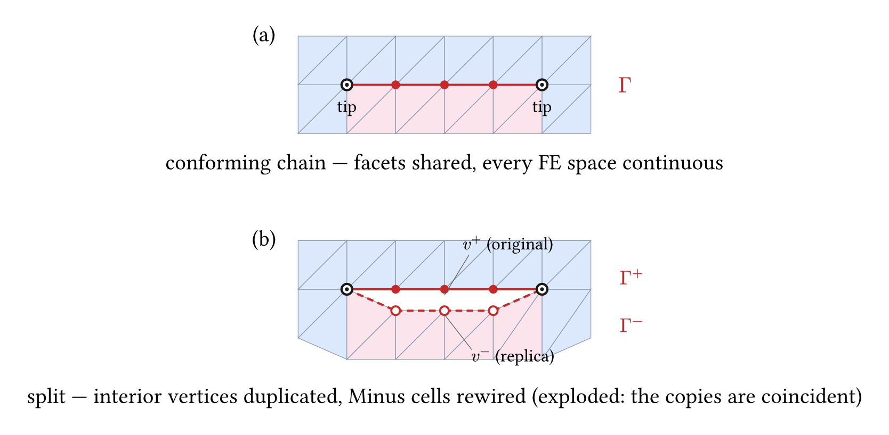
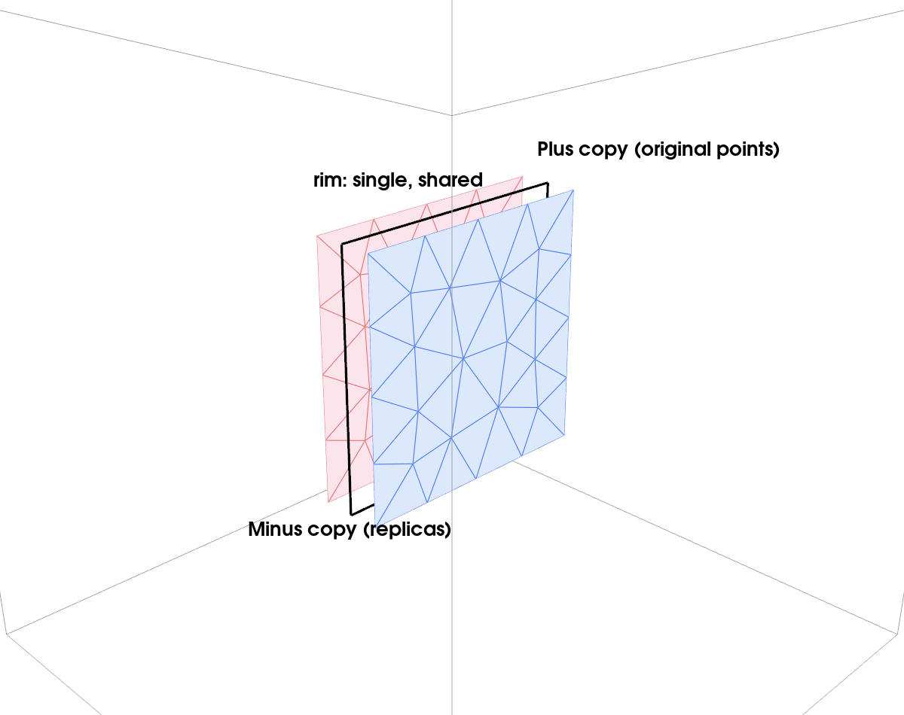
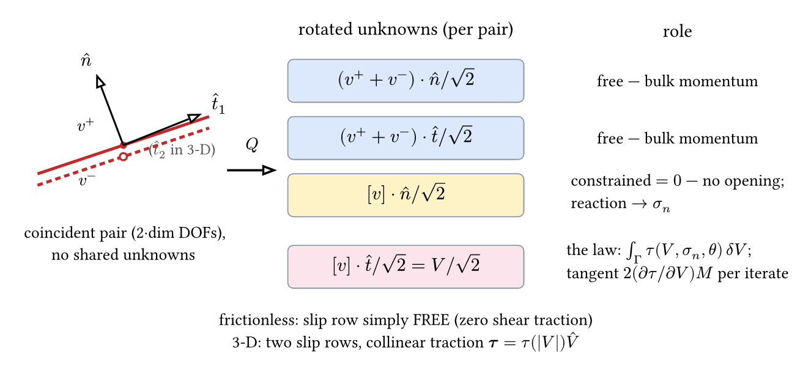
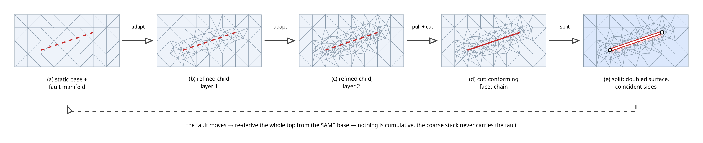
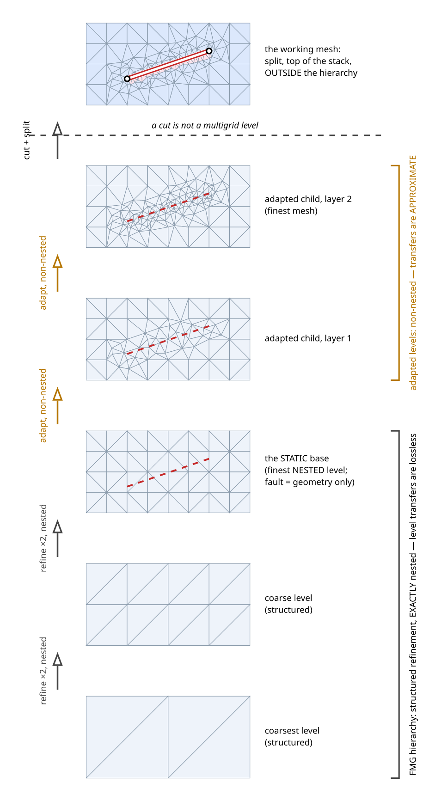

# Split-node faults: method and benchmarks

Technical outline for publication drafting (2026-08). Companion to the
architecture/deployment record in `FAULT_CONTACT_DEPLOYMENT_2026-08.md`;
this document is the *method itself* — formulation, mesh operation, trace
assembly, and the validation numbers — with the history and design
rationale deliberately omitted. Figures in `figures/split-node-faults/`
(cetz sources + generators alongside the committed PNGs).

## 1. Method in one paragraph

A fault is represented as a genuine velocity discontinuity: the mesh
points interior to a conforming fault surface are duplicated so that the
two sides share no degrees of freedom, and the coincident degree-of-freedom
pairs are transformed, inside the existing rotated-constraint solver path,
to mean and jump components in the local fault frame. The jump-normal
component is constrained to zero (no opening, enforced to machine
precision); the jump-tangential component — the slip rate $V$ — either
stays free (a perfectly slippery fault, zero shear traction) or carries an
interface constitutive law $\tau(V, \sigma_n, \theta)$ assembled on the
fault trace with a consistent Newton tangent derived symbolically. The
effective normal stress $\sigma_n$ is recovered from the constraint
reaction, and rate-and-state state $\theta$ evolves between solves by an
exactly integrated ageing law. No viscosity contrast, no thin layer, and
no Lagrange multiplier field is introduced anywhere.

## 2. Formulation

### 2.1 The split function space

Let $\Gamma$ be a chain of interior mesh facets (2-D) or a triangulated
patch of interior faces (3-D). Duplicating every mesh point strictly
interior to $\Gamma$ — vertices in 2-D; vertices, edges and the faces
themselves in 3-D — and rewiring the cells on one side to the replicas
makes every $C^0$ finite-element space discontinuous exactly across
$\Gamma$ and continuous everywhere else. The chain endpoints (2-D) and the
patch rim (3-D) are *not* duplicated: the field remains single-valued
there, so any slip must taper to zero at the tips/rim, which is the
physically correct crack condition and removes all special-casing at the
front.

*Fig. 1 — (a) the conforming labelled chain; (b) after the split
(exploded for display — the copies are geometrically coincident). Filled
red: original interior vertices (Plus side keeps them); open red: their
replicas (Minus side rewired); black rings: the shared, unsplit tips.*

*Fig. 2 — the same operation one dimension up, rendered from an actual
split mesh: the fault patch is doubled into two coincident triangulated
copies (pulled apart along the normal for display), joined at the single
shared rim.*

### 2.2 The pair transform

Each coincident pair $(v^+, v^-)$ carries $2\,d$ velocity unknowns
($d$ the dimension). One orthogonal $2d \times 2d$ block per pair rotates
them to mean and jump components in the fault frame
$(\hat n, \hat t_1[, \hat t_2])$, with the frame built per node from the
one-sided fault facet normals (so curved and kinked faults are handled by
construction). The rotation rides the same machinery as rotated free-slip
walls; the mean rows and the slip rows remain ordinary unknowns of the
bulk momentum balance, and only the jump-normal row enters the constrained
set.

*Fig. 3 — the rotated rows of one pair and their roles.*

Key properties, all consequences of the transform being orthogonal and
the constraint being strong:

- **No opening to machine precision.** The jump-normal row is an
  essential constraint with datum zero (a nonzero datum would be a
  prescribed dilation). Measured leak: $10^{-18}$ or exactly zero in every
  benchmark below.
- **The reaction of the jump-normal row is the normal traction.** The
  stashed bulk residual on the constrained rows, de-smeared by a positive
  trace mass, gives $\sigma_{nn}$ per node with no auxiliary flux solve —
  the same recovery as dynamic topography from rotated free-slip walls.
- **The welded limit removes the fault.** Any law on the slip rows
  penalises only the jump; the mean rows are never touched, so
  $\tau/V \to \infty$ recovers the uncut continuum on the same mesh, not a
  rigid inclusion.

### 2.3 Interface constitutive laws

A law is a sympy expression $\tau(V, \sigma_n, \theta)$ in three canonical
symbols (slip rate, effective normal stress, state). The consistent
tangent $\partial\tau/\partial V$ is produced by `sympy.diff` and both are
lambdified once at registration — the same division of labour as the bulk
constitutive models: the physics is symbolic, only the innermost
quadrature evaluates compiled callables. Implemented members:

| law | $\tau(V)$ | notes |
|-----|-----------|-------|
| frictionless | $0$ | slip row free; the stress-driven crack |
| viscous | $\eta_f V$ | $\eta_f = \eta_{\rm layer}/w$: the equivalent weak *layer's own* viscosity over its width (not the background's) |
| Coulomb | $\mu\,\sigma_n\,\tfrac{2}{\pi}\arctan(V/V_0)$ | regularised; $V_0$ well below flow rates ⇒ stick as creep $\sim V_0$ |
| rate-and-state | $a\,\sigma_n \sinh^{-1}\!\big[\tfrac{V}{2V_0} e^{(f_0 + b\ln(V_0\theta/D_c))/a}\big]$ | arcsinh regularisation, smooth and odd in $V$ |

The interface term $\int_\Gamma \tau(V)\,\delta V\,d\Gamma$ enters the
rotated residual on the slip rows and its tangent
$2\,(\partial\tau/\partial V)\,M$ ($M$ the trace mass) is rebuilt at every
Newton iterate — full Newton in $V$. Two quantities are deliberately
Picard-lagged, once per iterate: $\sigma_n$ (fed from the reaction; its
derivative is nonlocal and non-stiff) and $\theta$ (state evolves between
solves, not within one). In 3-D the traction is collinear with the slip,
$\boldsymbol\tau = \tau(|V|)\,\hat V$, and the per-node $2\times 2$
tangent block is

$$\frac{\partial\tau}{\partial V}\,\hat V\hat V^{\mathsf T}
  + \frac{\tau}{|V|}\left(I - \hat V\hat V^{\mathsf T}\right),$$

regularised at $|V| \to 0$ by the laws' own smoothness (the arctan/asinh
forms give $\tau/|V| \to \partial\tau/\partial V(0)$, so the zero-slip
block is isotropic).

### 2.4 State evolution and normal stress

The ageing law $\dot\theta = 1 - V\theta/D_c$ is integrated exactly over
each solve interval for piecewise-constant $V$:
$\theta' = \theta e^{-x} + (D_c/V)(1 - e^{-x})$, $x = V\,\Delta t/D_c$,
written with `expm1` so $V \to 0$ degrades smoothly to pure ageing.
$\theta$ varies by orders of magnitude along a fault and enters laws only
through $\ln\theta$, so the trace quadrature interpolates the *logarithm*
— which is also what keeps a positive-only quantity positive under the
quadratic shape functions (their undershoot sends a plainly interpolated
$\theta$ negative). $\sigma_n$ is fed to the laws SIGNED (positive in
compression); each law clamps its own strength at zero — bare friction
at $\sigma = 0$, cohesion at $\sigma = -C/\mu$ — because where
strength vanishes is constitutive. Where the strength is zero and the
normal stress is tensile, a real fault would open: no static solution
exists, and the bilateral no-opening constraint manufactures one by
carrying a tensile reaction. The computed state is then unphysical,
and the tell is the sign of the recovered normal traction. (A
unilateral contact — opening allowed — is a complementarity problem,
deferred.)

## 3. The mesh operation

*Fig. 4 — where the split sits in the meshing pipeline. The base mesh is
static and never carries the fault; adapt-on-top layers refine toward the
fault manifold (a dashed geometric object until (d)); the finest child is
cut so the fault becomes a conforming facet chain, and only then split.
When the fault moves, the whole top of the stack is re-derived from the
same base — the operation is non-cumulative by construction.*

*Fig. 5 — the same stack seen as a solver hierarchy. Below the base the
refinement is STRUCTURED and exactly nested (each level is the regular
refinement of the one beneath — the nesting in the drawing is generated,
and verified, not sketched), so level transfers are lossless: perfect
FMG. The adapted children above the base are non-nested, and their
transfers are approximate — that is where the approximation begins. The
cut + split working mesh sits on top of the stack but OUTSIDE the
hierarchy: a cut is not a multigrid level, and no level below it ever
carries the fault.*

### 3.1 Input contract and provenance

Input: a *conforming labelled facet set* — the fault's name labels
interior facets whose two support cells flank it. Any generator that
produces this contract feeds the split: `cut_along_lines` /
`place_along_lines` in 2-D, a gmsh-embedded surface
(`uw.meshing.BoxInternalPatch`) in 3-D, and the internal-boundary meshes
(`BoxInternalBoundary`, `AnnulusInternalBoundary`, …) carry it natively.

The split is a pure function of the source mesh (nothing cached, source
untouched): a moving fault is re-cut and re-split from the static base,
the same non-cumulative pattern as mesh adaptation. It returns two
provenance maps — `point_map` (old point → new point) and `clone_map`
(replica → original) — and the coincident pairing
`mesh._fault_point_pairs[name]` built from `clone_map`. The pairing is
the *only* source of the pair association: the two sides are
geometrically coincident, so no coordinate query can ever recover it.

### 3.2 2-D: the chain split

A fresh plex is built with the chart grown: cells keep their source order
(per-cell data stays aligned), replicas are appended to the vertex
stratum, and the edge stratum is re-derived from the substituted cell
list — an old facet is reused (labels intact) exactly where its vertex
pair survived, and re-homed onto replicas where it did not. Side
assignment walks the cut cell fan around each interior chain vertex;
every fault facet's two supports must land on opposite sides
(asserted, not assumed).

### 3.3 3-D: the patch split

The same operation one stratum deeper, with one structural change: rather
than hand-wiring tetrahedral cone orientations, the substituted cells are
built *uninterpolated* (vertex 4-tuples carry no orientation data) and
`DMPlexInterpolate` derives faces and edges. Cell and vertex numbering
are preserved (asserted), and every old face or edge is recovered in the
new chart by joining (`DMPlexGetFullJoin`) its mapped vertex tuple; a
tuple that no longer joins was re-homed, and its replacement is found by
collapsing replicas back to originals — the 2-D re-derivation rule
expressed through joins.

Side assignment: an orientability propagation gives every patch face a
consistent oriented triple (also proving the patch is one connected
orientable sheet); the sign of
$\det[\,b-a,\ c-a,\ d-a\,]$ classifies each fault face's two support
cells ($d$ the cell's off-face vertex); and around each interior patch
vertex the remaining star cells are flooded through shared non-fault
faces — the patch must cut every such star into exactly two half-balls.

Chart arithmetic (the structural test): with $F$ fault faces, $E_i$
interior patch edges and $V_i$ interior patch vertices, the split adds
exactly $(\Delta V, \Delta E, \Delta F) = (V_i, E_i, F)$ and the Euler
characteristic changes by $V_i - E_i + F$ = the patch interior's own
characteristic — $+1$ for any disc-like patch (2-D analogue: the slit
disc, $\chi: 1 \to 0$; 3-D: $\chi: 1 \to 2$, a ball acquiring a lens
cavity), independent of resolution.

### 3.4 Refusals (all loud, all collective)

| refused | reason |
|---------|--------|
| junction / non-manifold (three facets at an edge) | represent branches as offset segments (ligament of ~1–2 h) |
| closed loop (2-D), pinched or non-orientable patch (3-D) | no tips / star not two half-balls |
| single-facet chain; 3-D face with no interior vertex | the two copies would carry the same point tuple |
| fault touching the domain boundary | daylighting needs a wall/fault constraint composition (see open questions) |
| seam contact in 3-D; non-vertex seam crossings in 2-D | parallel rules below |

### 3.5 Parallel

2-D: a fault may cross a partition seam only *through a shared vertex
pinned exactly at the crossing* (the cut machinery manufactures these);
the crossing vertex's replica pair rides one extra star-forest entry,
keyed on (original root, side), and both flanking facet fans stay
rank-local. Everything else near a seam is refused, collectively (an
`allgather` synchronises the verdict so every rank raises together; a
seam verdict outranks the chain-fragment symptoms other ranks see).
Swept at np = 3, 4, 5: 17/27 crossing configurations split cleanly; every
refusal is collective and categorised (three-rank corners; fault running
along a seam). 3-D v1 requires the patch's whole cell star rank-interior
(a 3-D seam crossing is a *curve* — a design of its own, deferred).

## 4. Trace assembly

The interface residual and tangent are assembled on trace elements built
from the doubled facets, with nodes = the coincident pairs (tips/rim
enter with $V \equiv 0$ and receive no rows):

| | 2-D | 3-D |
|---|---|---|
| element | P2 line (3 nodes) | P2 triangle (6 nodes) |
| quadrature | 3-pt Gauss (degree 4) | 6-pt Dunavant (degree 4) |
| slip rows/node | 1 | 2 (matching the pair block's $\hat t_1, \hat t_2$ — one shared frame authority) |
| de-smear mass | lumped row-sum ($L/6, 2L/3, L/6$ — positive) | P1 sub-lumping ($A/12$ vertex, $A/4$ midpoint) |

The 3-D mass choice is forced: the lumped (row-sum) P2 *triangle* mass
has identically zero vertex rows, so the reaction de-smear divides by
zero there; subdividing each straight P2 triangle into its four P1
sub-triangles and lumping those gives every node a positive weight.

## 5. Benchmarks

All Stokes runs: P2 velocity / P0 discontinuous pressure (continuous
pressure smears the cross-fault pressure jump), `stokes.tolerance`
(never raw `ksp_rtol`), pressure nullspace attached, GAMG velocity
block on split meshes.

### 5.1 Conditioning: contact vs thin weak inclusion (2-D)

Identical adapted mesh, identical solver configuration, the fault
represented two ways:

| arm | representation | outer Schur its | wall time |
|-----|----------------|------------------|-----------|
| A | one-element band, viscosity contrast $10^{-4}$ | 147 | ~100 s |
| B | split-node, prescribed slip, **uniform viscosity** | 10 | ~6 s |

Both arms: every sub-KSP genuinely converged (checked via
`getConvergedReason`, not SNES status). The split's iteration count is
resolution-independent (10 at both refinement levels). Well-posedness:
$\int \nabla\!\cdot v \sim 2\times10^{-16}$; refinement moves stress
stations < 1.1 %; tolerance $10^{-5} \to 10^{-7}$ moves them 0.01 %; P0
pressure at the slit is a clean antisymmetric crack-tip dipole, no
checkerboarding. The two representations are different boundary-value
problems; their $\Delta$CFF *decay* families agree
(1/.392/.164/.055 vs 1/.406/.171/.057 at 0.1/0.25/0.5/1 fault lengths)
with amplitudes offset 6–9 %.

### 5.2 The frictionless crack (2-D)

Emergent slip under far-field shear: leak $5\times10^{-18}$; slip profile
elliptical to 1.45 % RMS; peak slip 91 % of the infinite-medium value
$\Delta\tau\,a/\eta$ (finite box, Dirichlet walls — below, as it must
be); converged in one Newton increment.

### 5.3 The viscous interface family (2-D)

$\tau = \eta_f V$ swept over three decades: monotone from the
frictionless crack to welded (peak slip 1 % of free at
$\eta_f = 100\,\eta/a$), machine-zero opening throughout, following the
crack compliance

$$V/V_{\rm free} = \frac{1}{1 + 0.91\,\eta_f\,a/\eta},$$

with the half-slip point at $\eta_f = \eta/a$ as dimensional analysis
requires. The welded endmember's stress field is indistinguishable from
the *uncut* continuum on the same mesh — the law penalises the jump only.

### 5.4 Friction and state (2-D and 3-D)

- Coulomb, sliding branch: constant-stress-drop behaviour (slip scales
  with the excess of driving stress over strength); stick branch: creep
  at the regularisation scale $V_0$. With $\sigma_n$ reaction-fed, the
  recovered normal stress matches the driven compression.
- Rate-and-state: from off-steady initial state, repeated solve/age
  cycles drive the monitor $\theta V/D_c$ monotonically to 1.
- Both re-verified in 3-D (regression-tested); the law layer itself is
  dimension-blind.

### 5.5 The penny-shaped crack (3-D)

Circular frictionless crack, radius $a = 0.15$, in an $L^3$ box of
uniform viscosity under uniform resolved shear $\tau$; oracle: the
incompressible ($\nu = 1/2$) infinite-medium profile

$$\Delta v(r) = \frac{8}{3\pi}\,\frac{\tau}{\eta}\sqrt{a^2 - r^2}.$$

| box $L$ | $h$ | pairs | leak | peak/oracle | fitted amplitude | shape RMS |
|--------|-----|-------|------|-------------|------------------|-----------|
| 1.0 | 0.05 | 144 | 0 | 0.930 | 0.866 | 6.9 % |
| 1.0 | 0.035 | 272 | 0 | 0.947 | 0.907 | 5.1 % |
| 1.5 | 0.05 | 144 | $6\times10^{-19}$ | 0.941 | 0.879 | 6.6 % |

Slip is parallel to the resolved shear everywhere (off-shear component
$< 10^{-2}$ of peak), and the amplitude sits *below* the oracle and
converges toward it from below under both mesh refinement and box
growth — the correct sign for a finite Dirichlet box, which is stiffer
than the infinite medium.

## 6. Current limitations

- One open chain (2-D) / one orientable disc-like patch (3-D) per label;
  branches via offset segments.
- No daylighting: the fault cannot reach the domain boundary.
- No closed loops (ring/spherical slippery surfaces).
- 3-D parallel: fault must be rank-interior.
- Split meshes carry no geometric-multigrid tail (coarse levels do not
  carry the fault); GAMG is the velocity default.
- Fault motion = re-cut + re-split from the base (fields transfer via
  the re-adaptation machinery); no incremental update.

## 7. Open design questions (under discussion)

1. **API unification with bulk rheology** — fault laws as
  constitutive-model-like objects with `Parameters`, assigned per fault,
  rather than per-law `add_*_fault_bc` functions.
2. **Closed-loop and daylighting interfaces** — the internal-boundary
  meshes already carry the split's input contract (verified:
  `AnnulusInternalBoundary`'s ring and `BoxInternalBoundary`'s spanning
  surface are conforming labelled facet sets; each is refused only by a
  topology rule, not by any plumbing gap). Loops need no-tip topology
  plus the new nullspaces of a disconnected interior body; daylighting
  needs the wall/fault constraint composition at the intersection.
