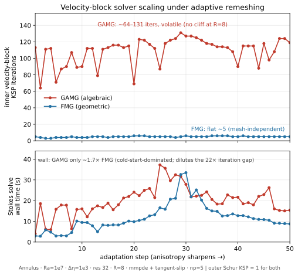
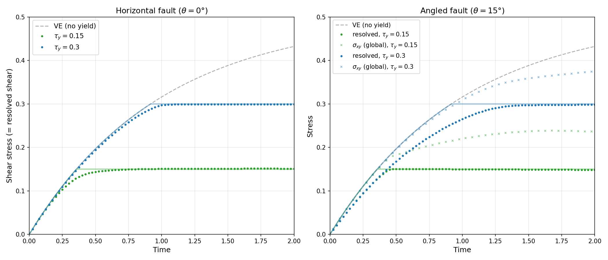
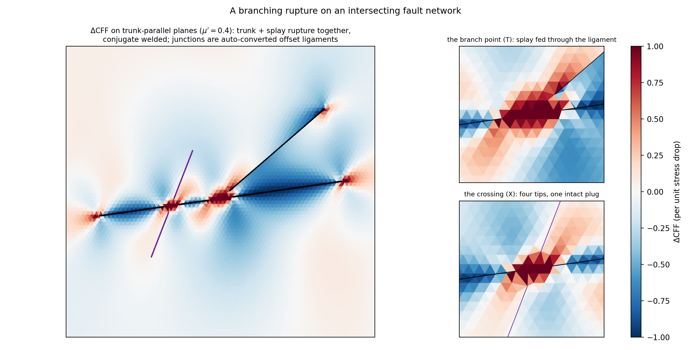
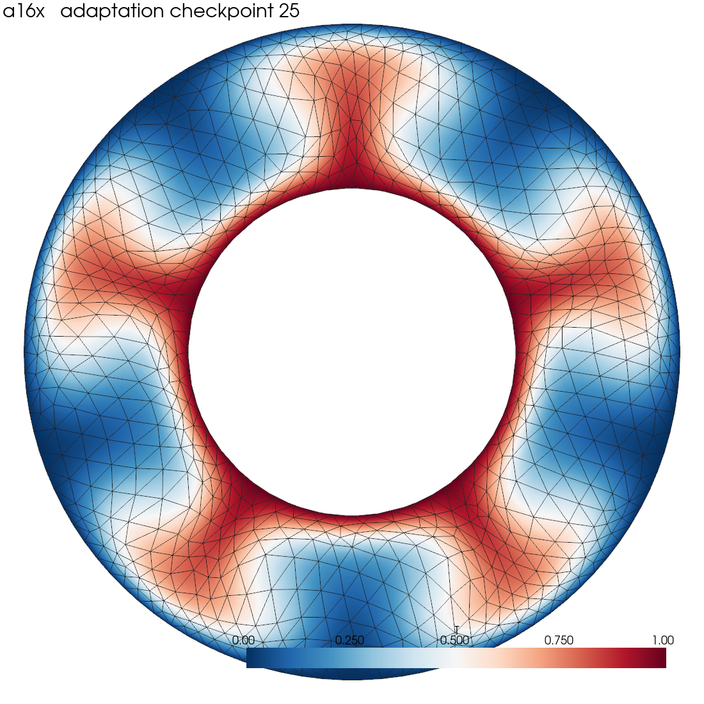
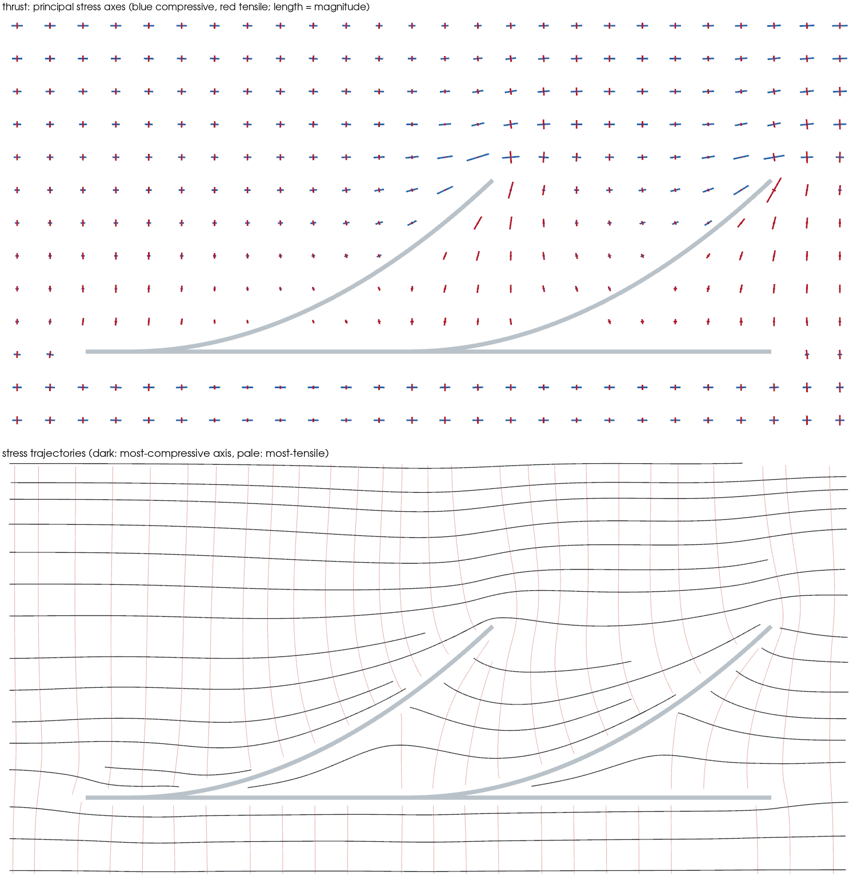
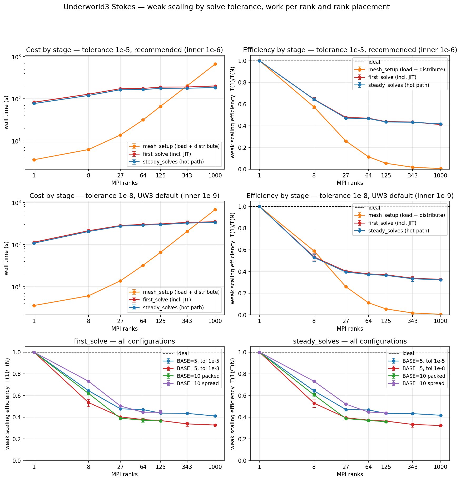

# Underworld3 v3.2.0 — what is in this release

A description of the released features for the Underworld3 Steering Committee. This release covers the 186 pull requests merged since v3.1.0 (8 July 2026). We have grouped the work into 21 capabilities and rated how ready each one is.

## How to read the ratings

We are adopting the **Technology Readiness Level (TRL)**, a 1–9 scale from NASA and currently used by the EU for Horizon Europe. It measures how ready a capability is for someone else to use. Two points on the scale matter to us:

- **TRL 4** is roughly where a change is good enough to merge: it works, it is tested, it is in
  the codebase.
- **TRL 6** is where we are willing to release it: a user can find out how to use it, there is a
  worked demonstration, and someone has undertaken to support it.

| | Meaning |
|---|---|
| 🟢 **Green — TRL 6+** | Released and supported. Documented, demonstrated, and we stand behind it. |
| 🟡 **Amber — TRL 5** | Validated in a realistic setting, not yet documented for release. |
| 🔴 **Red — TRL 1–4** | In the codebase and working, **not yet released.** Typically missing user documentation or a worked example. |

Red status indicates that a user could not yet pick it up from the documentation alone. The most common gap is a missing explanatory page. 

It is also worth knowing that tests can only ever demonstrate TRL 4. Levels 5 and above rest on documentation,
demonstration and real use. This is the reason why a well-tested feature
can still sit at 4.

**For this release: 9 green · 9 red · 1 not rated.** No capability currently sits at amber.

In the release notes these appear as 9 *Supported*, 8 *Preview*, 1 *In development*, and the
container work under *Highlights*. Green corresponds to Supported; red covers both Preview and
In development.

## At a glance

| | 🟢 Released and supported | 🔴 Working, not yet released |
|---|---|---|
| **1. Solvers and numerical methods** | Full multigrid · Navier–Stokes with SUPG · Analytic benchmark solutions | Free surface · Boundary flux recovery · Solver control and reporting · Geoid and self-gravity |
| **2. Rheology and material behaviour** | Materials system | Constitutive models · Transport histories |
| **3. Faults and discontinuities** | — | Fault networks |
| **4. Meshing and geometry** | Mesh smoothing · Curved boundary conditions | Mesh adaptation |
| **5. Data, input/output and visualisation** | Checkpoint and restart · Data access rules · Stress visualisation | Point location and evaluation |
| **6. Infrastructure and distribution** | *Containers and HPC builds - not rated on this scale* | |

Each is described in the section named, with the evidence behind its rating.

---

## 1. Solvers and numerical methods

 
<i><b>Figure 1. Multigrid under adaptive remeshing.</b> Solver iterations (top) and Stokes solve time (bottom) against remeshing step, for a Ra&nbsp;=&nbsp;10&#8311; annulus convection model remeshed every timestep. Full multigrid holds a mesh-independent ~5 iterations as the cells stretch; algebraic multigrid runs a volatile 64–131. The gain is predictability rather than raw speed and the wall-clock difference is only about 1.7×.</i>

- 🟢 **Full multigrid (`fmg`)** — Multigrid preconditioning for the Stokes velocity solve.
  **This capability is promoted from v3.1.0**, where it was Preview.
  Docs: [Multigrid preconditioning](https://github.com/underworldcode/underworld3/blob/development/docs/advanced/multigrid-preconditioning.md)
- 🟢 **Navier–Stokes with SUPG** — Flow where inertia matters, with the stabilisation needed to
  keep it well behaved.
  Docs: [Eulerian Navier–Stokes](https://github.com/underworldcode/underworld3/blob/development/docs/advanced/eulerian-navier-stokes.md) · Tutorial: [Unsteady flow](https://github.com/underworldcode/underworld3/blob/development/docs/beginner/tutorials/9-Unsteady_Flow.ipynb)
- 🟢 **Analytic benchmark solutions** — Closed-form solutions (SolKx, SolKz, SolDB, Richards)
  used to confirm the solvers converge at the rate the theory predicts.
  Docs: [Analytic solutions](https://github.com/underworldcode/underworld3/blob/development/docs/developer/subsystems/analytic-solutions.md) · Example: [Stokes SolC benchmark](https://github.com/underworldcode/underworld3/blob/development/docs/examples/fluid_mechanics/advanced/Ex_Stokes_Cartesian_SolC.py)
- 🔴 **Free surface** — The surface relaxes toward the equilibrium topography implied by the
  stress field, using an integrator that cannot overshoot. Now works in 3-D on a spherical
  shell. The method and its validation are written up in full, but there is no runnable
  example of it yet.
  Design notes: [Prognostic dynamic topography](https://github.com/underworldcode/underworld3/blob/development/docs/developer/design/FREESLIP_DYNAMIC_TOPOGRAPHY_FREESURFACE.md) · Tests: [plume](https://github.com/underworldcode/underworld3/blob/development/tests/test_1070_free_surface_plume.py), [3-D spherical](https://github.com/underworldcode/underworld3/blob/development/tests/test_1072_free_surface_spherical.py)
- 🔴 **Boundary flux recovery** — Recovers an accurate surface flux (heat flux, or traction) from
  the solver residual rather than by differentiating the solution.
  Implementation: [boundary_flux](https://github.com/underworldcode/underworld3/blob/development/src/underworld3/utilities/boundary_flux.py) · Tests: [test_1019](https://github.com/underworldcode/underworld3/blob/development/tests/test_1019_boundary_flux.py)
- 🔴 **Solver control and reporting** — Diagnostics for what the solver actually did: convergence
  history, tolerance handling, and analysis of runs that stall.
  Docs: [Solver iteration callbacks](https://github.com/underworldcode/underworld3/blob/development/docs/advanced/solver-iteration-callbacks.md)
- 🔴 **Geoid and self-gravity** (TRL 3) — Geoid response functions for spherical shells and
  annuli. Earliest-stage entry in the release.
  Reference: [Postprocessing](https://github.com/underworldcode/underworld3/blob/development/docs/api/postprocessing.md)

## 2. Rheology and material behaviour

 
<i><b>Figure 2. Viscoelastic-plastic shear box benchmark.</b> Shear box with an embedded fault, tested against the analytic viscoelastic solution with a plastic yield cap. <b>Left</b>: horizontal fault. <b>Right</b>: fault at 15°, where shear resolved onto the fault plane caps at the yield stress (circles) while the global stress keeps building (crosses) as the surrounding bulk continues to load. All cases land within 1–2% of the analytic cap. This illustrates <b>Constitutive models</b>, below.</i>

- 🟢 **Materials system** — Separates *what a material is* from *where it is*, so one rheology can
  be attached to particles or to regions without rewriting it.
  Docs: [Particle populations and materials](https://github.com/underworldcode/underworld3/blob/development/docs/advanced/particle-population-and-materials.md) · Example: [Material swarm](https://github.com/underworldcode/underworld3/blob/development/docs/examples/utilities/intermediate/Ex_Swarm_Material_Index.py)
- 🔴 **Constitutive models** — Viscous, viscoplastic, viscoelastic-plastic, diffusion and Darcy.
  **The viscoelastic-plastic failures reported at v3.1.0 are fixed**: all seven tests that were
  suspended for that release now pass, without the tests being altered. One accuracy drift in
  the transverse-isotropic path remains open, which is why this stays red.
  Docs: [Transverse isotropy and faults](https://github.com/underworldcode/underworld3/blob/development/docs/advanced/vep-transverse-isotropy-faults.md) · Benchmark: [Viscoelastic-plastic square](https://github.com/underworldcode/underworld3/blob/development/docs/advanced/benchmarks/vep-square.md)
- 🔴 **Transport histories** — Material history carried through time. New this quarter: history
  can be stored at integration points rather than at mesh nodes.
  Docs: [Semi-Lagrangian time integration](https://github.com/underworldcode/underworld3/blob/development/docs/advanced/semi-lagrangian-time-integration.md) · Tutorial: [Timestepping](https://github.com/underworldcode/underworld3/blob/development/docs/beginner/tutorials/7-Timestepping-simple.ipynb)

## 3. Faults and discontinuities

 
<i><b>Figure 3. Branching fault rupture.</b> A dextral trunk fault with a splay branching from its midpoint and a conjugate fault crossing it. The trunk and splay rupture together while the conjugate stays welded. The bright features are junction plugs: intact ligaments carrying the load shed by their slipped neighbours, which is where a through-going rupture would break next.</i>

- 🔴 **Fault networks** — Faults as genuine discontinuities in the mesh rather than smeared weak
  zones: a fault is described once, then realised either as a split-node cut with contact laws
  or as a volumetric weak plane. **The largest single body of work this quarter**, and the most
  extensively illustrated: see [fault mechanics examples](../../advanced/fault-mechanics-examples.md).
  It is red because the capability bundles several parts and one of them is still early.
  Docs: [Fault networks](https://github.com/underworldcode/underworld3/blob/development/docs/advanced/fault-networks.md) · Examples: [Fault mechanics](https://github.com/underworldcode/underworld3/blob/development/docs/advanced/fault-mechanics-examples.md)

## 4. Meshing and geometry

 
<i><b>Figure 4. Adaptive remeshing of a convection plume.</b> Ra&nbsp;=&nbsp;10&#8309; annulus thermal convection on a coarse base mesh, remeshed every five steps. The mesh grades into the inner thermal boundary layer and the plume conduits while the cells stay well shaped. This illustrates <b>Mesh adaptation</b>, below.</i>

- 🟢 **Mesh smoothing** — The Winslow interior smoother, which the adaptive movers and multigrid
  both build on. Carried over unchanged from v3.1.0 and revalidated for this release.
  Docs: [Node redistribution](https://github.com/underworldcode/underworld3/blob/development/docs/advanced/mesh-adaptation.md#node-redistribution--the-snuggling-mover) · Design notes: [Metric-driven node redistribution](https://github.com/underworldcode/underworld3/blob/development/docs/developer/design/mesh-adaptation-formulation.md)
- 🟢 **Curved boundary conditions** — Boundary conditions applied using true geometric normals
  instead of the flat-facet approximation, which matters on spheres and annuli.
  Docs: [Curved boundary conditions](https://github.com/underworldcode/underworld3/blob/development/docs/advanced/curved-boundary-conditions.md) · Example: [Annulus Stokes benchmark](https://github.com/underworldcode/underworld3/blob/development/docs/examples/fluid_mechanics/advanced/Ex_Stokes_Annulus_Benchmark_Kramer.py)
- 🔴 **Mesh adaptation** — Metric-driven adaptive remeshing. Substantial work this quarter,
  including 3-D tetrahedral redistribution. Worked examples exist, but predate this quarter's
  changes, and the adaptation path is not yet fully covered by the validation suite.
  Docs: [Adaptive mesh refinement](https://github.com/underworldcode/underworld3/blob/development/docs/advanced/mesh-adaptation.md) · Example: [Adaptive metric refinement](https://github.com/underworldcode/underworld3/blob/development/docs/examples/utilities/advanced/MeshRefine-AdaptiveMetric-Dynamic.py)

## 5. Data, input/output and visualisation

 
<i><b>Figure 5. Principal stress in a blind-thrust model.</b> Principal-stress crosses (top) and stress trajectories (bottom) for a blind-thrust model, over a faint strain-rate wash. Far-field crosses are horizontal, showing compression; in the wedges riding each ramp they turn red and near-vertical, showing tension, largest just above the blind ramp tips. This illustrates <b>Stress visualisation</b>, below.</i>

- 🟢 **Checkpoint and restart** — Saving and resuming a run, including exact reload onto the same
  mesh.
  Docs: [Snapshot and restore](https://github.com/underworldcode/underworld3/blob/development/docs/advanced/snapshot-restore.md)
- 🟢 **Data access rules** — The contract for safely reading and writing field data, which
  prevents a common class of silent corruption.
  Docs: [Data access and the array contract](https://github.com/underworldcode/underworld3/blob/development/docs/developer/subsystems/data-access.md) · Tutorial: [Variables](https://github.com/underworldcode/underworld3/blob/development/docs/beginner/tutorials/2-Variables.ipynb)
- 🟢 **Stress visualisation** — Principal-stress glyphs and stress trajectories.
  Docs: [Visualising the stress tensor](https://github.com/underworldcode/underworld3/blob/development/docs/advanced/stress-visualisation.md)
- 🔴 **Point location and evaluation** — Finding points in a mesh spread across many processors
  and evaluating functions there. Much faster this quarter; documentation moved by two lines.
  Reference: [Functions and evaluation](https://github.com/underworldcode/underworld3/blob/development/docs/api/function.md)

## 6. Infrastructure and distribution

Performance is measured in a separate campaign on Gadi at the National Computational
Infrastructure, published at
[underworld3-scaling](https://github.com/underworld-community/underworld3-scaling). The figures
below are **v3.1.0 measurements taken in August 2026** — the v3.2.0 round has not yet been run.

 
<i><b>Figure 6. Stokes weak scaling.</b> Work per processor is held constant while processors are added, so
a flat line is ideal. Almost all of the loss happens in the first 27 processors, while a single
48-core node fills; beyond that the curves flatten and all four configurations hold 0.82–0.92 of
their 27-processor efficiency out to 1000.</i>

 
<i><b>Figure 7. Advection–diffusion weak scaling.</b> The solver itself scales well: the right-hand panel
shows the implicit solve (purple) holding 0.89 efficiency out to 1000 processors. The
semi-Lagrangian advection that carries material history (green) does not, falling to 0.13.</i>

- ⚪ **Containers and HPC builds** *(not rated)* — How people obtain and run Underworld3: a
  rebuilt container that cannot drift from the development environment, and automated builds for
  NCI Gadi, together with the scaling campaign above. Not rated on this scale because a container
  is proven by deploying successfully, not by a test. *Owner: @jcgraciosa.*
  Docs: [Installation](https://github.com/underworldcode/underworld3/blob/development/docs/beginner/installation.md) · Docs: [Container README](https://github.com/underworldcode/underworld3/blob/development/container/README.md)

---

## Work not represented above

Thirty-eight further pull requests changed no user-facing capability: test infrastructure,
developer tooling, readability and release process. They have no TRL rating and appear in the
Bug Fixes and Improvements sections of the release notes.

Two bodies of work are named here and neither is a capability anyone invokes
directly: both correct machinery that already existed, so there is nothing new for a user to learn
and nothing to demonstrate. Both are substantial, and their evidence is tests rather than
documentation.

- **Collective robustness under MPI (15 pull requests).** Correct behaviour when one processor holds
  little or nothing to work on. This is the failure mode where one processor takes a shortcut and
  every other one waits forever. Covered by 13
  ordinary and 14 parallel test files, all passing at 4 processors.
- **Deterministic code generation.** Turning the symbolic description of a problem into solver code,
  now reproducible across processors: every processor compiles identical code, and two constants
  sharing a name no longer collapse into one. This removes a class of processor-dependent
  disagreement that was very hard to diagnose. Covered by 6 ordinary and 1 parallel test file.

## What we would value from the committee

1. **Which red capabilities should be prioritised for release?**
2. **Confirmation that TRL is the right framework** to keep using for future releases.

We are also not asking for a formal sign-off form this quarter. Agreement recorded in the meeting
minutes is sufficient.

## Where the evidence is

The full technical table — every capability, its implementation files, its documentation, its
test coverage, and the results of running the suite on 1, 2 and 4 processors — is at
[v3.2.0-feature-table.md](v3.2.0-feature-table.md).
