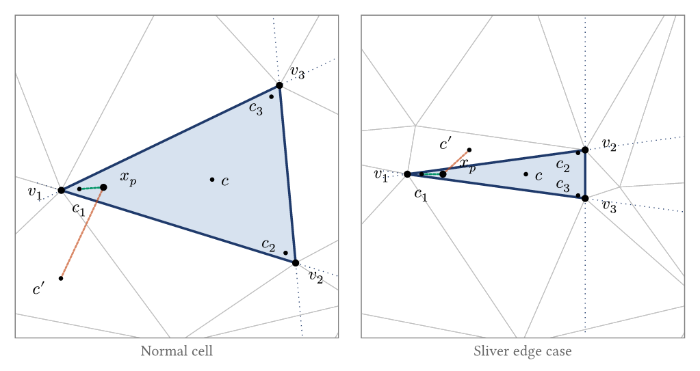
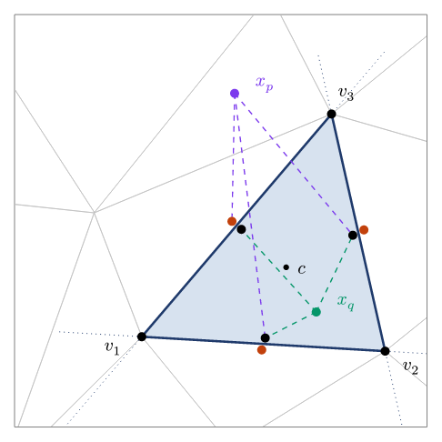
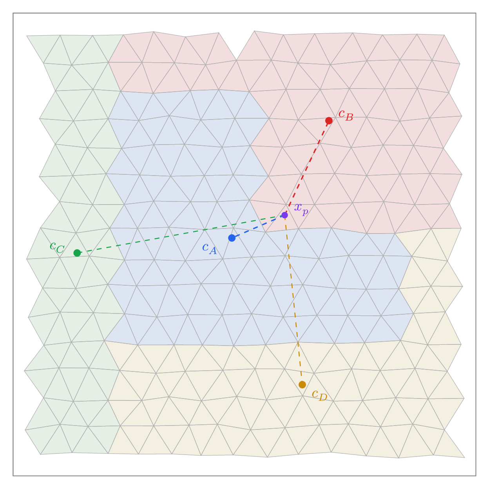
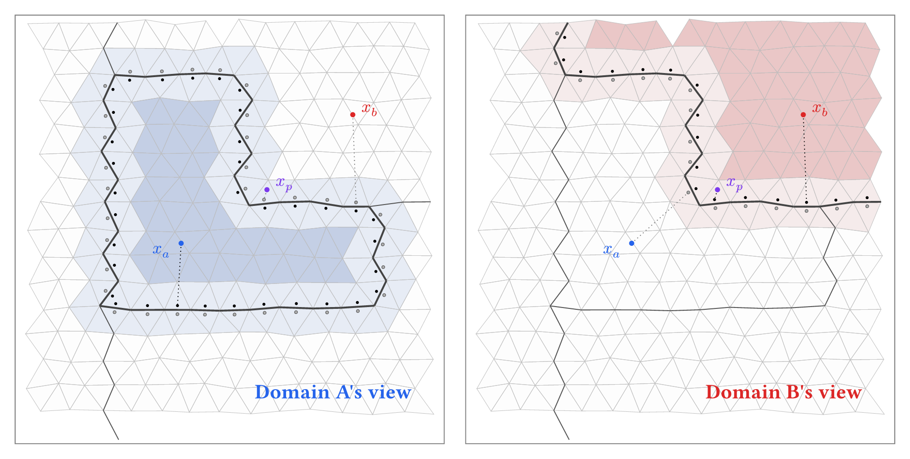

Lagrangian particles are central to geodynamics modelling. They track material properties through large deformation, carry stress history for viscoelastic models, and define material interfaces. But managing particles in a finite element mesh is harder than it looks. On a structured grid, finding which cell contains a given point is arithmetic. On an unstructured mesh of triangles or tetrahedra, it is a search problem. And when the mesh is decomposed across processors, it becomes a distributed search problem with communication costs.

This post describes how Underworld3 locates particles in an unstructured mesh, and then how it extends that to work across a parallel decomposition.

## The Geometric Problem

Given a point $x$ and an unstructured mesh of convex cells, which cell contains $x$? 

On a structured grid you compute an index. On an unstructured mesh, you have to test cells until you find one that contains the point. Testing whether a point is inside a convex cell is straightforward in principle. Each face of the cell defines a half-space. If the point is on the interior side of every face, it is inside the cell. For a triangle with three edges, that is three half-space tests. For a tetrahedron with four faces, four tests.

The expensive part is deciding which cells to test. A brute-force scan over all cells is $O(N)$ per particle. With millions of particles and millions of cells, this is prohibitive. UW3 uses a two-stage approach: a fast approximate lookup followed by a geometric confirmation.

### Stage 1: Approximate Lookup via KDTree

A first-pass approach might be to find the cell whose centroid is nearest to the particle. This is likely to be very close to the actual cell containing the particle, but it is not guaranteed. In a Delaunay triangulation, cells can be far from equilateral. A long, thin triangle has its centroid near the middle of the long axis, far from a point that sits inside the triangle near one of its acute vertices. A neighbouring, more equilateral triangle may have a closer centroid even though the point is not inside it.

UW3 addresses this by placing multiple control points per cell: one near each vertex (nudged 1% toward the cell centroid) plus the centroid itself. This ensures that every region of the cell is close to at least one of its control points, regardless of aspect ratio. All control points across the mesh are stored in a KDTree built on nanoflann, a C++ nearest-neighbour library providing $O(\log n)$ queries.

*Control points used for cell location: the cell centroid $c$ plus one nudge point per vertex ($c _ 1$, $c _ 2$, $c _ 3$, each 1% from $v _ i$ toward $c$). **Left (normal cell):** a test point $x _ p$ near the acute vertex $v _ 1$ is closer to the neighbouring centroid $c'$ (rust line) than to the highlighted cell's own centroid $c$, but its nearest control point overall is the nudge $c _ 1$ (teal line). The KDTree correctly identifies the highlighted cell. **Right (sliver edge case):** a highly elongated cell has its nudge points crowded near the long axis. A test point near $v _ 1$ still picks $c _ 1$ as nearest, even when it is fractionally on the wrong side of an edge. This is the geometry that motivates the Stage 2 confirmation.*

Given a particle position, the KDTree returns the nearest control point, which maps to a candidate cell. The vertex-nudged points make this a much better guess than centroid-only lookup, but it is still not guaranteed correct for points near cell boundaries. If a point lies outside the domain boundary, there is no containing cell, but there is still a nearest cell. For these cells, we need a validation test ***"is this point within this cell or not"***. It is important to be able to identify this situation cleanly and pass this point to a different domain to handle.

### Stage 2: Inside/Outside Confirmation

*An unstructured triangulation with a highlighted element. Each face carries a pair of control points: one just inside the cell (black) and one just outside (rust). A test point is connected to the marker on the same side of each face as the centroid: $x _ q$ — interior — lands on three black markers; $x _ p$ — exterior — lands on a rust marker for the face it has crossed. A point is inside the cell iff every connection is black.*

To confirm that a particle is inside its candidate cell, UW3 uses precomputed control point pairs on each face. During mesh setup, each face gets two markers: one placed just inside the cell (offset by a small distance along the inward normal from the face centroid) and one just outside. These are the black and rust-coloured dots in the diagram.

At query time, the test is purely distance-based. For each face, compare the squared distance from the particle to the outer control point versus the inner control point:

$$
\| x - x _ \text{outer} \|^2 - \| x - x _ \text{inner} \|^2 > 0
$$

If the particle is closer to the inner point, it is on the centroid side of that face. A particle is inside the cell if and only if this holds for all faces. No normals, no dot products, no plane equations at query time. The geometry was baked into the control point positions during mesh setup. The computation is vectorised over all particles and all faces using NumPy. For a triangle, this is three distance comparisons per particle. For a tetrahedron it is four. 

This approach is exact for linear meshes (where faces are planar).

### When the Candidate Is Wrong

If the KDTree returns a candidate cell and the inside/outside test fails, the particle is in a neighbouring cell. The algorithm queries the KDTree for the next-nearest control point, tests that cell, and repeats. In practice, the first candidate is almost always correct, and at most one or two iterations are needed.

## Scaling to Parallel

On a single processor, the algorithm above is sufficient. On a parallel mesh, each processor owns a subset of cells. A particle that has moved outside its processor's domain needs to be found, relocated to the correct processor, and have all its variable data transferred. It is important in this situation for the algorithm to be categorical about **not owning** a particle. 

### Migration Between Processors

After advection, particles that are outside their local domain need new owners. The first step is deciding where to send them. Each MPI rank computes its domain centroid, and a KDTree is built from all centroids across all ranks. For a displaced particle, the nearest centroid gives a candidate destination.

*A mesh decomposed into four processor domains. The particle $x _ p$ is inside domain B but closer to domain A's centroid $c _ A$ than to $c _ B$. A nearest-centroid assignment would send the particle to the wrong processor. Dashed lines show distances to all four domain centroids. The domain shapes here are exaggerated for illustration. Real decomposition tools like METIS produce more compact domains that minimise boundary surface area, but the centroid ambiguity still arises near irregular partition boundaries.*

The centroid ambiguity illustrated above is the parallel analogue of the elongated-triangle problem at the element level. Domain decompositions are irregular, and a domain's centroid does not represent all of its territory equally. So the centroid KDTree gives a candidate, not a final answer. Once a particle arrives at its candidate processor, it needs to be verified.

### Domain Ownership Test

Each processor needs to confirm whether an arriving particle is actually inside its local domain. UW3 places control point pairs along the boundary faces of the processor's subdomain, just as it does for individual cells. Boundary faces are identified as faces belonging to only one cell (they sit on the edge of the local partition). Each face gets an inside marker and an outside marker, and a KDTree is built from all of them.

For a given particle, the nearest boundary control point is found. If it is an inside marker and the particle is far from the boundary, the particle is clearly inside the domain. If it is an outside marker and the particle is far away, the particle is clearly outside. These two cases are fast.

*Each panel shows one domain's view. Dark shading marks the region that is clearly inside (far from any boundary control point). Light shading marks the boundary zone where the sign of the nearest control point is not reliable. White is clearly outside. Black dots are inside control points; grey dots are outside control points. The particle $x _ a$ is clearly inside A and clearly outside B. The particle $x _ b$ is the reverse. The particle $x _ p$ falls in the boundary zone of both domains and requires the more expensive cell-location test to resolve.*

The boundary zone exists because processor subdomains are typically non-convex. For a convex domain, the nearest-control-point sign would always give the correct answer. But when the boundary folds back on itself, a particle near one part of the boundary might have its nearest control point on a different, unrelated part of the boundary. The sign of that control point tells you nothing useful about which side of the nearby boundary the particle is on. In this zone, UW3 falls back to the full cell-location test from the element-level algorithm: find the candidate cell via the KDTree, confirm with the face control point pairs.

### Example: making `dm.migrate()` fast

Migration is the parallel-only cost of working with particles. As particles move through the physical domain, they will often change their owning process. They, and their data container, must then be sent efficiently from the old to the new owner.  To determine the new owner, we need to be able to ask a small likely-candidate subset of processes whether they categorically own the landing point, and, when we find the correct target, transfer the particle and its data. The UW3 algorithms above are able to 1) relliably guess which processes to ask for each point, 2) uniquely guarantee ownership through cell queries, 3) negotiate all locations prior to efficient data transfer with PETSc's `dm.migrate()`.

The global centroid KDTree is the key piece. Each rank computes its own domain centroid and shares it once — a small array, replicated on every rank, refreshed only when the decomposition changes. That one-time exchange is the only communication needed before per-step migration can start working. After advection, each rank runs the ownership test against its own boundary control points to identify the particles that need to leave. For each of those, the centroid KDTree gives the nearest rank as a purely local lookup. By the time per-step communication begins, every rank already knows: which of its particles are leaving, the destination rank of each one, and how many are going to every other rank. The ranks with non-zero counts are its **candidate peers** — the (typically small) set of other ranks it actually needs to talk to this step.

What follows is a short negotiation scoped to the candidate peers — each rank tells its candidates how many particles are coming, and learns the same from any candidate sending to it. Then a single coordinated transfer moves the bulk data point-to-point, sender to receiver. The communication is sparse: only candidate pairs participate, and the data block is one round rather than a sequence of probes. The work each rank does scales with its own departing particle count — no $P$-dependent inner loop, no central coordinator, no all-to-all probe phase. PETSc handles the MPI plumbing.

Some particles still arrive at the wrong rank — the centroid prediction is a heuristic and can be imprecise near irregular boundary zones (see the figure above). The receiving rank's ownership test catches these. They are repacked with the next-closest centroid and the call repeats. The iteration converges quickly because each round only re-processes the leftover boundary-zone particles. After a few attempts, any particle still unaccounted for has left the mesh entirely and is usually removed from the simulation.

The centroid KDTree is a cheap ingredient that buys the whole architecture. Cost is local; communication is point-to-point; no rank ever needs to know what any other rank is holding. That is what makes `dm.migrate()` fast.

### A Second Example: `global_evaluate()`

The same predict-then-send pattern underlies `uw.function.global_evaluate(expr, coords)`, which evaluates a symbolic expression at a set of points that may live on any rank. Interpolating a field requires the values of the underlying mesh variables, and those are only available on the rank that owns the relevant cells. So the query points have to travel to their owners, get evaluated, and come back carrying the evaluation data. 

UW3 implements this as a round-trip `migrate`. Each rank wraps its query points in a temporary evaluation swarm, with each point labelled by its origin rank and original index. The same centroid KDTree we built for migration gives the owning rank of every query point as a local lookup — and again, each rank learns its candidate peers before any per-step communication begins. The first migrate sends the points to their owning ranks. Each owner evaluates the expression at its local set of points and stores the result on a swarm variable. The destination of each result is then set back to the origin rank (recorded at outbound time), and a second migrate sends the results home. Origin ranks unpack results by index and reassemble the answer in the original order. The return rank is guaranteed (it is the originating rank) so ownership tests can be skipped. 

---

*The Underworld project is supported by AuScope and the Australian Government through the National Collaborative Research Infrastructure Strategy (NCRIS). Source code: [github.com/underworldcode/underworld3](https://github.com/underworldcode/underworld3)*
