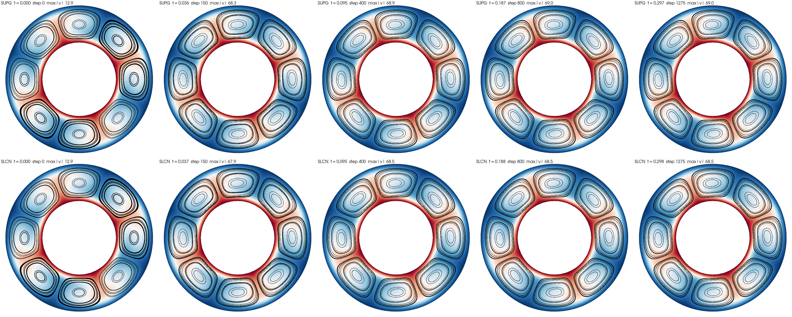

Underworld3 now has two schemes for moving a scalar field with the flow. The semi-Lagrangian scheme has been the default since the beginning of the UW3 project: it traces characteristics back from each node, samples the old field at the departure point, and treats diffusion with Crank-Nicolson on the mesh. The new one is an implicit, Eulerian scheme that assembles the advection term directly in the weak form and stabilises it with streamline-upwind Petrov-Galerkin (SUPG) weighting. We have run both on the same problems, on the same meshes, with the same time steps, and this post is about what we found and which one we now recommend for what.

## The two schemes

The semi-Lagrangian scheme (`uw.systems.AdvDiffusionSLCN`) never assembles an advection operator. Each step it integrates the velocity backwards from every node to find where the material now at the node came from, interpolates the previous field there, and solves a diffusion problem with that history as the source. Nothing in the linear system depends on the velocity, so the system is symmetric and has no stability limit on the time step. What it costs is the trace-back: an interpolation of a P2 field at scattered points every step, which in parallel means finding which rank owns each departure point.

The Eulerian scheme (`uw.systems.AdvDiffusionSUPG`) puts $\mathbf{u}\cdot\nabla\phi$ in the residual and integrates it in time with Crank-Nicolson by default, or BDF2 with `order=2`. On its own, the Galerkin form of the advection term produces oscillations wherever advection dominates diffusion in a cell. SUPG adds a term to the weak form that weights the strong residual along the streamline direction:

$$
\mathbf{F} _ 1 \mathrel{+}= \tau \, \mathbf{u} \, R, \qquad R = \dot\phi + \mathbf{u}\cdot\nabla\phi - f .
$$

Because $R$ is the residual of the equation we are solving, this term vanishes at the exact solution and the scheme stays consistent. The parameter $\tau$ is built from the time step, the local cell size and velocity, and the diffusivity, and every one of those enters the compiled kernel as a runtime constant, so changing the time step does not recompile anything.

The two classes have the same constructor and the same `solve(timestep=dt)` call, so switching between them is one line:

```python
adv = uw.systems.AdvDiffusionSUPG(mesh, T, V_fn=v.sym, order=1)   # or AdvDiffusionSLCN
adv.constitutive_model = uw.constitutive_models.DiffusionModel
adv.constitutive_model.Parameters.diffusivity = 1.0
adv.solve(timestep=dt)
```

## A Gaussian going round in a circle

The first test is a Gaussian blob carried once around the origin by a rigid rotation, on a P2 mesh with 32 cells across the box. After one revolution the field should be back where it started, and the difference is the error of the scheme. The variable is the Courant number $C$, the number of cells the flow crosses in one time step.

| Courant | SUPG error | SLCN error | SUPG min / max | SLCN min / max | s per step SUPG / SLCN |
|---|---|---|---|---|---|
| 0.5 | 0.6% | 21% | 0.00 / 0.99 | -0.03 / 0.84 | 0.058 / 0.363 |
| 2 | 9.8% | 7.7% | -0.01 / 0.99 | -0.01 / 0.92 | 0.055 / 0.355 |
| 8 | 66% | 8.8% | -0.35 / 0.76 | 0.00 / 0.98 | 0.060 / 0.331 |
| 32 | fails | fails | | | |

The two schemes fail in different ways and at different places. The Eulerian scheme's error grows with the square of the time step, which is Crank-Nicolson doing what it does, and at Courant 8 the field rings: the minimum is -0.35 on a field that should stay between 0 and 1. The semi-Lagrangian scheme has the opposite behaviour. Its error hardly depends on the time step, because it is set by the interpolation at the departure points, and that error accumulates once per step. Small steps mean many interpolations, so the scheme is at its worst at Courant 0.5, where it has lost 16% of the peak after one revolution. The crossover is near Courant 2, and the Eulerian scheme costs about a sixth as much per step on either side of it.

The last column is the one that surprised us least but matters most in practice. The semi-Lagrangian trace-back is expensive: six times the cost of a stabilised implicit solve on the same mesh, and the gap does not close on finer meshes.

## Thermal convection

The test that matters for what we do is convection. We ran the Blankenbach benchmark box at Rayleigh numbers of 10⁴ and 10⁵ and an annulus at 10⁴, with the same Stokes solver, the same P2 mesh and the same time step rule for both transport schemes, and compared the Nusselt numbers, the root-mean-square velocity and the temperature fields themselves.


The answers are the same. In the box at Rayleigh 10⁴ the two schemes agree on the root-mean-square velocity to 0.1% and on the Nusselt number to 0.4%, and both are within 0.6% of the published values on this mesh. At Rayleigh 10⁵ the interior heat transport, measured across the mid-plane, is within 0.2% of the reference for both. In the annulus both settle into the same eight-cell pattern with Nusselt numbers within 0.7% of each other. The temperature fields differ pointwise by less than 0.002 in the box and 0.007 in the annulus.



What differs is the cost and the reproducibility. The transport step costs 0.06 s with SUPG and 0.64 s with the semi-Lagrangian scheme in the box, 0.18 s against 1.55 s in the annulus: a factor of ten either way. On four processors the SUPG run gives the same answer as the serial one to every digit, because the assembled operator does not care where the partition boundaries are. The semi-Lagrangian answer moves in the fourth digit with the processor count, because the departure-point interpolation does depend on which rank owns a point. Doubling the Courant number moves the SUPG Nusselt number by 0.05% and the semi-Lagrangian one by 0.9%.

One thing we did learn on the way is how to measure the heat flow. The Nusselt number is usually taken as the temperature gradient at the wall, and on a P2 mesh that under-resolves the thermal boundary layer the wall gradient comes out a few per cent high for both schemes. We now compute it as the boundary integral of the total heat transport, advective plus diffusive, evaluated at the integration points and projected onto a nodal field, and we report the same quantity across the mid-plane as well. The interior value is the better-resolved number when the wall layer is thin, and it is the one that lands on the reference.

## Which to use

For convection at the Courant numbers we normally run, the Eulerian SUPG scheme is our recommendation. It gives the same answer as the semi-Lagrangian scheme, it is exactly conservative, it costs a tenth as much per transport step, and its answer does not depend on the number of processors. The semi-Lagrangian scheme keeps its place where the time step is much larger than the cell-crossing time, which is a situation that arises in tracer-like problems more than in convection, and there it is the accurate one. It also carries vectors and tensors through the trace-back with no extra work, which the Eulerian scheme does not yet do.

The Eulerian scheme also gives us a cleaner base for what comes next. The stabilised, assembled advection operator extends to vector unknowns, and that is the route to a Navier-Stokes solver on the grid and, after that, to transporting stress for viscoelastic materials. Those are for another post.
